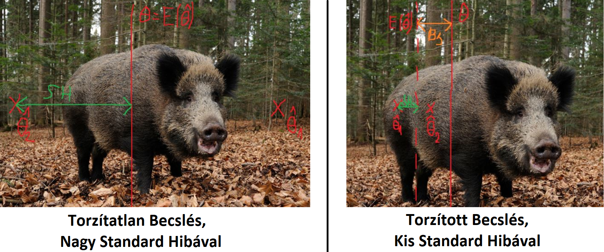

<style>
body {
text-align: justify}
</style>


```{r setup, include=FALSE}
knitr::opts_chunk$set(echo = TRUE)
```

## 1. Ismétlés: Balaton átúszás eredmények és ezek FAE mintái

Folytassuk ott a dolgainkat, ahol a 2. heti anyagban abbahagytuk. Töltsük be egy `pandas` data frame-be a <a href="https://github.com/KoLa992/Statisztika-II-Python-Jegyzet/blob/main/LIDLBalaton2022.xlsx" target="_blank">LIDLBalaton2022.xlsx</a> fájl adatait. Ebben az Excelben a 2022-es LIDL Balaton átúszás résztvevőinek *neve, neme és percben mért időeredménye* található. Ez az adatsor lesz most nekünk a **sokaságunk**.

```{python}
# Elemzéshez és ábrázoláshoz szükséges csomagok betöltése
import numpy as np
import pandas as pd
import matplotlib.pyplot as plt
import scipy.stats as stats

# Adatbeolvasás data frame-be
Balcsi = pd.read_excel("LIDLBalaton2022.xlsx")

Balcsi.info()
Balcsi.head()
```

Oké, meg is vagyunk! A sokságnak $N=9751$ eleme van, tehát ennyi versenyző úszta át 2022-ben a Balatont. A sokaságnak alapvetően egy ismérvével, **az időeredménnyel** (`PERC` oszlop) **fogunk foglalkozni, és ennek három** statisztikai mutatóját vagy szebben fogalmazva **statisztikai paraméterét fogjuk megvizsgálni**:

- Az **átlag**os időt Jele: $\bar{Y}$ vagy $\mu$
- Az egyéni idők **szórás**át Jele: $\sigma$
- A 3 óra (180 perc) felett teljesítők **arányát** Jele: $P$

Ahogy a <a href="Gyak02.html" target="_blank">2. heti tananyagban</a> ezt tisztáztuk, egy **teljes statisztikai** adatsor, azaz **sokaság statisztikai mutatóit/paramétereit együttesen $\theta$-val jelöljük**.

Akkor hát **számoljuk is ki ezeket** a $\theta$-kat! Még kiszámoljuk az időeredmények varianciáját (szórásnégyzetét) is, mert erre is szükségünk lesz a későbbiekben.

```{python}
SokasagiAtlag = np.mean(Balcsi.PERC)
SokasagiSzoras = np.std(Balcsi.PERC)
SokasagiVariancia = SokasagiSzoras**2
SokasagiArany = np.sum(Balcsi.PERC > 180)/len(Balcsi)

SokasagiAtlag
SokasagiSzoras
SokasagiArany
```

Meg is vagyunk! Akkor **következő lépésben vegyünk is egy $n=100$ elemű FAE** (tehát visszatevéses véletlen) **mintát ebből a sokaságból** egy $1992$-es véletlen mag mellett. Majd **számoljuk is ki a három vizsgált statisztikai paraméter értékét a mintában**.

```{python}
BalcsiMinta = Balcsi.sample(n = 100, replace = True, random_state = 1992)

BalcsiMinta.info()

MintaAtlag = np.mean(BalcsiMinta.PERC)
MintaSzoras = np.std(BalcsiMinta.PERC)
MintaArany = np.sum(BalcsiMinta.PERC > 180)/len(BalcsiMinta)

MintaAtlag
MintaSzoras
MintaArany
```

Ezek szerint összefoglalva statisztikai **paramétereink mintából becsült értékei**:

- $\bar{y}=164.4$ perc
- $s^* = 38.6$ perc
- $p = 0.3=30\%$

Szintén a <a href="Gyak02.html" target="_blank">2. heti tananyagban</a> szerepelt, hogy a **statisztikai paraméterek mintából becsült értékeit együttesen $\hat{\theta}$-val jelöljük**. A $\hat{\theta}$-ok **speciális elnevezése: becslőfüggvény** a *valódi, sokasági* $\theta$-hoz. Szóval, a mintaátlag ($\bar{y}$) a sokasági átlag $\bar{Y}=\mu$ *becslőfüggvénye*, a mintából számolt szórás ($s^*$) a valós, sokasági szórás ($\sigma$) *becslőfüggvénye* és a mintából számított 3 órán túli úszók aránya ($p$), a sokasági arány ($P$) *becslőfüggvénye*.

A feladatunk pedig az lenne, hogy rájöjjünk: **Hogyan tudunk egyetlen egy db $n$ elemű minta $\hat{\theta}$ becslőfüggvény értékeiből következtetni a teljes $N$ elemű sokaság valós $\theta$ paraméter értékeire?** Ez a **statisztikai becsléselmélet alapfeladata**. Azt is körbejártuk a <a href="Gyak02.html" target="_blank">2. heti tananyagban</a>, hogy ha a mintavételünk tényleg rendes FAE mintavétel, akkor ami $\hat{\theta}$ és a valós $\theta$ között áll az nem más, mint a **mintavételi hiba (MVH)**. A feladatunk tehát konkrétabban nézve az **MVH kiszámítása vagy legalábbis valamilyen közelítése**.

Ahhoz, hogy **elinduljunk az MVH számítás rögös útján egy olyan trükkel élünk, ami kihasználja, hogy most éppen ismerjük a teljes Balatont átúszó sokaságot**. Nyilván a gyakorlatban azért kell becsléselmélettel meg MVH számítással foglalkozni, mert a sokaságot nem tudjuk megismerni. :) De most mivel megvannak a sokasági adatok, így **kivehetünk a sokasági időeredményekből nagyon-nagyon sok, mondjuk $10000$ db $n=100$ elemű mintát**.<br>
Ezt meg is tettük a <a href="Gyak02.html" target="_blank">2. heti tananyag legvégén</a>. Most csak **visszatöltjük az eredményt tartalmazó Excel táblát egy data frame-be**. Az Excel fájl, amit ebben a jegyzetben használok <a href="https://github.com/KoLa992/Statisztika-II-Python-Jegyzet/blob/main/MintaDataFrame.xlsx" target="_blank">innen</a> elérhető.

```{python}
MintaVetelek100Elem = pd.read_excel("MintaDataFrame.xlsx")
MintaVetelek100Elem
```

Oké, az eredményből látjuk is, hogy úgy néz ki a data frame, hogy **1 sor tartalmaz 1 db 100 elemű mintát és a mintaelemeket** (tehát a mintába besorsolt versenyző percben mért időeredményét) **az oszlopkban tároljuk**.

Ez a tárolási forma azért is kényelmes, mert a data frame "*szeletelésével*" bármikor tudunk $n<100$ elemű mintákat is előállítani. Hiszen a mintavétel a pitonkának köszönhetően teljesen véletlenszerű volt, így **ha kiválasztom a tábla első $20$ oszlopát az olyan, mintha lenne $10000$ db $n=20$ elemű mintám is!**<br>
Ezt most tegyük is akkor meg!

```{python}
MintaVetelek20Elem = MintaVetelek100Elem.iloc[:, 0:20]
MintaVetelek20Elem
```

Szuper, olybá tűnik akkor jók vagyunk! :)

## 2. A torzítatlanság fogalma

Na hát akkor vizsgáljuk meg először a $10000$ db $n=100$ elemű mintát alaposabban ahhoz, hogy megértsük: **hogyan is viselkednek a $\hat{\theta}$ becslőfüggvények a valós $\theta$ paraméterekhez képest**.

Először **számoljuk ki mindegyik $100$ elemű mintában a három** statisztikai mutatónk, azaz **becslőfüggvényünk értékét**: átlag, szórásnyégyzet (variancia) és a 180 percen felül teljesítők aránya. A szórás kapcsán kényelmesebb lesz a gyökjel nélkül vizsgálni a dolgokat, ezért veszünk varianciát.<br>
Szerencsénkre, a `numpy` csomag statisztikai függvényei `axis = 1` paraméter beállítással soronként és NEM oszloponként számolják ki az átlagot, varianciát, összegeket, így **minden mintára ki tudjuk számolni a becslőfüggvények értékét 1-1 új oszlopban**. **Figyeljünk** arra, hogy mivel a data frame oszlopai folyamatosan bővülnek, így manuálisan le kell szorítani a `numpy` statisztikai függvények alkalmazását mindig az első 100 oszlopra az `iloc` metódussal!

```{python}
MintaVetelek100Elem['Atlagok'] = np.mean(MintaVetelek100Elem.iloc[:,0:100], axis=1)
MintaVetelek100Elem['Varianciak'] = np.std(MintaVetelek100Elem.iloc[:,0:100], axis=1)**2
MintaVetelek100Elem['Aranyok'] = np.sum(MintaVetelek100Elem.iloc[:,0:100] > 180, axis=1)/100

MintaVetelek100Elem
```

Oké, olybá tűnik, hogy mind a $10000$ db mintára megvan mindhárom becslőfüggvény a `MintaVetelek100Elem` data frame utolsó három oszlopában.

Következő lépésként **vegyük a mintaátlagos és a mintaarányok átlagát, és vessük össze az eredményeke a valós sokasági átlaggal és aránnyal!**

```{python}
AtlagokAtlaga = np.mean(MintaVetelek100Elem['Atlagok'])
AranyokAtlaga = np.mean(MintaVetelek100Elem['Aranyok'])

[AtlagokAtlaga, SokasagiAtlag]
[AranyokAtlaga, SokasagiArany]
```

Hoppá, a **kétféle értékek egészen közel vannak egymáshoz!** Sőt, némi **kerekítéssel a becslőfüggvények átlaga megegyezik az adott paraméter valós sokasági értékével!**

```{python}
[round(AtlagokAtlaga,1), round(SokasagiAtlag,1)]
[round(AranyokAtlaga*100, 1), round(SokasagiArany*100, 1)]
```

Amit itt tapasztalunk az a **TORZÍTATLANSÁG jelensége**. Eszerint, **ha az összes lehetséges mintából számolt $\hat{\theta}$-ok átlaga** (vagy más szóval várható értéke) **megegyezik a valós, sokasági $\theta$ értékével, akkor a $\hat{\theta}$ becslőfüggvény torzítatlan**. A **torzítatlanság esetünkben azért teljesül csak kerekítésekkel, mert mi csak $10000$ db minta alapján vizsgálódunk, és nem vettük ki az összes lehetséges mintát**, mivel azt valószínűleg nem bírta volna el a RAM-unk az $N=9751$ elemű sokaság esetén. :)

A **fenti fogalom matematikai formalizmussal** az alábbi formát ölti. A képletben az $E()$ függvény az átlagolás, azaz *várható érték* jele, ami az angolban ugyebár *expected value* álnéven fut ... innen az *E*. :) $$E(\hat{\theta})=\theta$$

Ha a **fenti egyenlőség teljesül az összes lehetséges tetszőleges $n$ elemű mintában, akkor $\hat{\theta}$ torzítatlan becslése $\theta$-nak**.

Ebből kiindulva pedig megadhatjuk a **torzítottság fokának (angolul Bias, rövidítve $Bs$)** definícióját is, ami nem más, mint a **becslőfüggvények** ($\hat{\theta}$-ok) **várható értékének különbsége** a valós, **sokasági** $\theta$ **értéktől**:$$Bs=E(\hat{\theta})-\theta$$ 

Láthatjuk, hogy $10000$ db mintát vizsgálva az **átlag és arány**, mint $\theta$ paraméterek esetében elég kicsi ez a $Bs$. Mindkét esetben **1 tizedesre kerekítve $0$ a torzítás**.

```{python}
# Bs(Átlag)
round(AtlagokAtlaga - SokasagiAtlag, 1)
# Bs(Arány)
round(AranyokAtlaga - SokasagiArany, 1)
```

Oké, a kis $10000$ db $n=100$ mintás kísérletünk alapján azt mondhatjuk, hogy a **mintaátlag és mintaarány torzítatlan becslőfüggvényei a valós sokasági átlagnak és sokasági aránynak**.

De mi a helyzet a szórás frontján? Konkrétan, **első körben vizsgáljuk meg, hogy a mintákból számolt szórásnégyzetek torzítatlan becslései-e a sokasági szórásnégyzetnek, azaz varianciának!**

```{python}
VarianciakAtlaga = np.mean(MintaVetelek100Elem['Varianciak'])

[VarianciakAtlaga, SokasagiVariancia]

# Bs(Variancia)
round(VarianciakAtlaga - SokasagiVariancia, 1)
```

Jajj! Olybá tűnik, hogy **a válasz NEM**! A **mintából számolt varianciák, azaz ${(s^*)}^2$-ek átlaga a valós, sokasági varianciához képest esetünkben $18.4$-gyel alacsonyabb érték!** Tehát, a **mintavariancia, mint becslőfüggvény lefelé torzít a valós sokasági szóráshoz képest!** Kellemetlen. Hiszen, ez **azt jelenti, hogy egy mintából számolt variancia a valós soksági értékhez képest jó eséllyel kisebb lesz**. Ez azért szerencsétlen, mert eszerint a **vizsgált ismérvünk szóródásáról, indagozásáról egy mintából nézve a valósághoz képest jellemzően kisebb értéket látunk**.<br>
Tehát, pl. egy részvény árfolyamának szóródását (kockázat) az árfolyamadatok egy mintájából nézve a valósághoz képest jellemzően kisebbnek látjuk. **A "kockázat" alulbecslése pedig egy olyan probléma, amivel kezdeni kell valamit!**

A **jelenség matematikailag** az alábbi módon írható le: $$E\left({(s^*)}^2 \right) < \sigma^2$$

Azaz: $$Bs\left({(s^*)}^2\right) < 0$$

### 2.1. Az aszimptotikus torzítatlanság fogalma

Ami valamilyen szinten menti a helyzetet az az a tény, hogy bár a **sokasági variancia alapból torzítottan becsülhető a mintavarianciákkal**, de a becslés viszont **aszimptotikusan torzítatlan**. Ez azt jelenti, hogy **mintaelemszám növelésével a torzítás mértéke ($|Bs|$) csökken, konkrétan $0$-ba tart**. Azaz: $$\lim_{n \rightarrow \infty}{Bs\left({(s^*)}^2\right)}=0$$

Próbáljuk **szemléltetni a jelenséget!** A data frame-k **1. fejezet végén bemutatott oszlopkiválasztásával** $10000$ db $n=\{10,20,30,...,90,100\}$ elemű minta esetén kiszámoljuk a mintavarianciák $Bs({(s^*)}^2)$ értékét a valós sokasági varianciához ($\sigma^2$) képest.<br>
Természetesen, technikailag ezt egy `for` ciklus segítségével tudjuk megoldani:

- A ciklus minden iterációjában kiválasztjuk a megfelelő elemszámú mintákat a `MintaVetelek100Elem` data frame-ből
- Kiszámoljuk minden elemszám esetén ${(s^*)}^2$-et mind a $10000$ db mintára
- Kiszámoljuk és egy `list`-ben eltároljuk $Bs({(s^*)}^2)$, mint $E({(s^*)}^2)$ és a valós, sokasági variancia, $\sigma^2$ különbsége

```{python}
# Üres lista létrehozása Bs-ek tárolására
Bs_Lista = []
# Vizsgált elemszámok listájának létrehozása
# 10 és 100 közötti egész számok felsoroltatása a 'range' függvényben 10-es lépésközzel
# Felső határ 101 a nyílt intervallum miatt
Elemszam_Lista = range(10, 101, 10)

# Ciklus indítása
for AktualisElemszam in Elemszam_Lista:
  AktualisMintaVetelek = MintaVetelek100Elem.iloc[:, 0:AktualisElemszam].copy()
  AktualisMintaVetelek['Varianciak'] = np.std(AktualisMintaVetelek, axis = 1)**2
  AktualisVarianciakAtlaga = np.mean(AktualisMintaVetelek['Varianciak'])
  AktualisBs = AktualisVarianciakAtlaga - SokasagiVariancia
  Bs_Lista.append(round(AktualisBs, 1))

# Eredmény megtekintése 
Bs_Lista
```

Szépen láthatjuk, hogy **a $Bs$ értékek abszolút értéke** az elég hatalmas $201.4$-től indulva **szépen lefut** az $n=100$ esetben **korábban is mért $18.4$-be**. Az eredmények még látványosabbak egy vonaldiagramon ábrázolva.

```{python}
# Vizsgált elemszámok és a mért Bs-ek data frame-be rendezése
# Ahol az elemszámok a sorindexek
BsData = pd.DataFrame(np.abs(Bs_Lista), columns=['Bs_AbszErtekek'], index = range(10, 101, 10))

# Ábrázolás a 'plot' metódussal: nem kell paraméterezni, mert csak egy oszlopunk van
BsData.plot()
plt.show()
```

Szépen, gyakorlatilag exponenciális ütemben csökken a $Bs$ abszolút érték, bár a **csökkenés nagysága $n=90$-ről $n=100$-ra már nem túl jelentős**! Ez azt jelenti, hogy **varianciák esetén a torzítás mértéke függ az $n$ elemszámtól!** Minél nagyobb az elemszám, annál kisebb a torzítás mértéke, tehát az $|Bs|$.

## 3. A korrigált mintavariancia

A 2.1. fejezetben tapasztalt tényt, miszerint a mintavariancia $(s^*)^2$ a valós, sokasági $\sigma^2$-nek **aszimptotikusan torzítatlan becslése** fel lehet használni a **variancia torzítási probléma megoldására**.

Ugyebár azt tudjuk az szimptotikusan torzítatlanságból, hogy minél nagyobb az elemszám, annál kisebb a torzítás mértéke. Sőt, azt is meg lehet mondani, hogy **a mintavarianciák várható értéke, $E\left((s^*)^2\right)$ arányaiban $\frac{n-1}{n}$-nel tér el a sokasági varianciától, $\sigma^2$-től**. Azaz igaz a következő egyenlőség: $$\frac{E\left((s^*)^2\right)}{\sigma^2}=\frac{n-1}{n}$$

Újrahasznosítva a $Bs$-ek meghatározására alkalmazott `for` ciklusos megoldásunkat, a **fenti összefüggés helyessége is ellenőrizhető $n=\{10,20,30,...,90,100\}$ elemszámok mesetén**. 

```{python}
# Üres lista létrehozása a (várható érték) / (sokasági variancia) hányadosok tárolására
Hanyados_Lista = []
# Üres lista létrehozása az (n-1)/n hányadosok tárolására
ElemszamHanyados_Lista = []
# Vizsgált elemszámok listájának létrehozása
# 10 és 100 közötti egész számok felsoroltatása a 'range' függvényben 10-es lépésközzel
# Felső határ 101 a nyílt intervallum miatt
Elemszam_Lista = range(10, 101, 10)

# Ciklus indítása
for AktualisElemszam in Elemszam_Lista:
  AktualisMintaVetelek = MintaVetelek100Elem.iloc[:, 0:AktualisElemszam].copy()
  AktualisMintaVetelek['Varianciak'] = np.std(AktualisMintaVetelek, axis = 1)**2
  AktualisVarianciakAtlaga = np.mean(AktualisMintaVetelek['Varianciak'])
  Hanyados_Lista.append(round(AktualisVarianciakAtlaga/SokasagiVariancia, 3))
  ElemszamHanyados_Lista.append(round((AktualisElemszam - 1)/AktualisElemszam, 3))

# Eredmények összefűzése data frame-be 
Hanyados_df = pd.DataFrame(
  list(zip(ElemszamHanyados_Lista, Hanyados_Lista)),
  columns=['(n-1)/n', 'VarhatoErtek/SokasagiVar'])
Hanyados_df
```

Szuper, **aránylag szépen kijön a kétféle hányadosok közötti egyezőség**! :) Persze itt is van némi **eltérés, mivel csak $10000$ db mintát vizsgálunk és nem az összes lehetségeset**, de ez még így is látványos egyezés! Így már **érthető, hogy a $Bs$ abszolút értéke miért nem csökkent már látványosan $n=90$-ről $n=100$-ra: az $\frac{n-1}{n}$ hányados mindkét esetben már elég kicsit volt, így a torzítás mértéke is!**

Viszont, ha a $\frac{E\left((s^*)^2\right)}{\sigma^2}=\frac{n-1}{n}$ egyenlőség igaz, akkor azt átrendezve a következő összefüggésre jutunk: $$\sigma^2=\frac{n}{n-1} \times E\left((s^*)^2\right)$$

Konstans szorzót egy átlagolás ($E(...)$) eredményén alkalmazni ugyan az, mintha minden kiátlagolandó elemet felszoroztam volna azzal a szorzóval. Tehát az $\frac{n}{n-1}$ bevihető a várható érték függvényen belülre: $$\sigma^2= E\left(\frac{n}{n-1} \times (s^*)^2\right)$$

Mindezek alapján pedig azt mondjatjuk, hogy **az $s^2=\frac{n}{n-1} \times (s^*)^2$ módon KORRIGÁLT MINTAVARIANCIA már TORZÍTATLANUL becsli a valós sokasági varianciát, azaz $\sigma^2$-t!** Hiszen $\sigma^2= E\left(s^2\right)$.

Tyűha, ez nagyon szépen hangzik! :) **Próbáljuk ki! Számoljuk ki a $10000$ db $n=100$ elemű mintában a korrigált mintavarianciákat, és nézzük meg azok átlagát (várható értékét)!**

```{python}
# Elemszám megadása külön változóban
n = 100

# Korrigált varianciák
MintaVetelek100Elem['KorrigaltVar'] = (n/(n-1)) * MintaVetelek100Elem['Varianciak']

# Torzítatlanság ellenőrzése
KorrVarAtlaga = np.mean(MintaVetelek100Elem['KorrigaltVar'])

[KorrVarAtlaga, SokasagiVariancia]
round(KorrVarAtlaga - SokasagiVariancia, 1)
```

Győzelem! :) Ha **nem is szűnt meg teljesen a dolog, de láthatóan nagyon alacsony, majdnem elhanyagolható lett a $Bs$ mértéke**! Sőt, már nem lefele torzítunk azzal a minimális $1.1$-gyel, hanem felfelé, ami egy szóródás becslésnél még a "*jobbik eset*". Lásd a korábbi pénzügyi kockázat becslése példát. :) Ha **lenne több mintánk, akkor a korrekció ki is nullázná a $Bs$-t**.

Ezek alapján akkor jó lenne, ha **lenne valami beépített függvényünk** az `std` helyett, ami **mintaadatok esetén alapból a KORRIGÁLT SZÓRÁS $s = \sqrt{s^2}=\sqrt{\frac{n}{n-1} \times (s^*)^2}$ értékét számolja**!

Nos, **valójában az** `std` **tud korrigált szórást számolni egy extra paraméter segítségével**. Ahhoz, hogy **megértsük a paraméter működését egy picit végig kell gondolni a korrigált szórás képletének a működését**.

Alapból a mintaadatok $s^*$ szórását az alánbbi képlettel számoljuk: $$s^*=\sqrt{\frac{\sum_{i=1}^n{(y_i-\bar{y})^2}}{n}}$$

Azaz, megnézzük, hogy minden $y_i$ mintaelem mennyivel tér el a minta $\bar{y}$ átlagától, majd ezen eltéréseket négyzetre emelve összeadjuk és az összeget leosztjuk a minta $n$ elemszámával, végül gyököt vonunk az egész hányadosból.<br>
Ennek az értéknek a négyzete a sima, *nem korrigált* variancia: $$(s^*)^2=\frac{\sum_{i=1}^n{(y_i-\bar{y})^2}}{n}$$

Ha a fenrti variancia képletet beszorozzuk $\frac{n}{n-1}$-gyel akkor a következő egyszerűséítéseket tehetjük: $$s^2=\frac{n}{n-1} \times \frac{\sum_{i=1}^n{(y_i-\bar{y})^2}}{n} = \frac{\sum_{i=1}^n{(y_i-\bar{y})^2}}{n-1}$$

Tehát, a **minta korrigált szórását úgy számoljuk ki mint a nem korrigáltat, csak a NEVEZŐBEN $n-1$-gyel osztunk, nem pedig $n$-nel**: $$s=\sqrt{\frac{\sum_{i=1}^n{(y_i-\bar{y})^2}}{n-1}}$$

Ezt az **eltérést a nevezőben** a `ddof = 1` **paraméter beállítással jelezzuk** a `numpy` csomag `std` függvényében. Könnyen kitalálható, hogy alapértelmezésben `ddof = 0` beállítással fut az `std` függvény. :)

Lássuk is a dolgot akcióban!

```{python}
# Korrigált varianciák 'std'-vel
MintaVetelek100Elem['KorrigaltVar_std'] = np.std(MintaVetelek100Elem.iloc[:,0:100], axis=1, ddof = 1)**2

# Torzítatlanság ellenőrzése
KorrVarAtlaga_std = np.mean(MintaVetelek100Elem['KorrigaltVar_std'])

[KorrVarAtlaga_std, SokasagiVariancia]
round(KorrVarAtlaga_std - SokasagiVariancia, 1)
```

Királyság! Tökéletesen ugyan ott vagyunk, mint az előbb a manuális számolással! :)

**Szépen szakszavakkal összefoglalva** tehát az a fő tanulságunk, hogy

1. A **sima mintavariancia ($(s^*)^2$) a sokasági variancia $\sigma^2$ TORZÍTOTT becslőfüggvénye**
2. A **korrigált mintavariancia ($s^2$)** viszont **a sokasági variancia $\sigma^2$ TORZÍTATLAN becslőfüggvénye**

## 4. A medián torzítatlansága

**Stat. 1-en nagyon fontos mutatónk volt a medián**, mint a vizsgált ismérv felezőpontja, hiszen nem volt érzékeny a kilógó értékekre az adatsorban, mint az átlag. **Nézzük meg** itt a Balaton átúszás 100 elemű mintáinak példáján, hogy ez a statisztikai paraméter **torzítatlanul becsülhető-e!**

```{python}
# Sokasági medián átúszási idő
SokasagiMedian = np.median(Balcsi.PERC)

# Mintabeli mediánok kiszámítása
MintaVetelek100Elem['Medianok'] = np.median(MintaVetelek100Elem.iloc[:,0:100], axis=1)

# Mintabeli mediánok átlaga
MedianokAtlaga = np.mean(MintaVetelek100Elem['Medianok'])

# Torzítatlanság ellenőrzése
[MedianokAtlaga, SokasagiMedian]
round(MedianokAtlaga - SokasagiMedian, 1)
```

Olybá tűnik, hogy a medián a mintabeli mediánokkal **torzítatlanul becsülhető** A $Bs(me) = E(me) - Me$ eltérés olyan minimális, hogy simán elhihető, hogy megszűnik, ha az összes lehetséges $n=100$ lemeű mintát vizsgálnánk és nem csak $10000$-et.

## 5. A Standard Hiba (*SH*) fogalma

Szép és jó, hogy megállapítottuk, hogy a mintaátlag, mintaarány, korrigált mintavariancia és mintamedián **torzítatlan becslőfüggvény**ei a nekik megfelelő sokasági $\theta$ paramézereknek, de **mire jó ez nekünk a gyakorlatban, amikor csak egyetlen egy darab mintavételünk van?**

Hiszen, mint a 3-4. fejeuetekben tapasztaltuk, a torzítatlanság csak annyit mond, hogy ha van **nagyon-nagyon sok mintavételünk**, akkor a vizsgált statisztikai mutatónk/paraméterünk mintából számított értékei (becslőfüggvények) **átlagosan eltalálják a mutató valós, sokasági értékét**. De sajnos ebbe a **definícióba nagyon sok minden belefér**, és igazából **önmagában a mintavételi hibáról (MVH) nem mond semmit**.<br>
Ezt a problémát nagyon jól érzékelteti a következő *favicc*.

> "Egy mérnök, egy fizikus és egy statisztikus együtt mennek vaddisznóra vadászni. Alig tesznek meg néhány lépést az erdőben, máris észrevesznek 150 méterre egy hatalmas példányt.<br>
>  A mérnök felemeli a puskáját, céloz és lő, de három méterrel mellétalál jobbra. A fizikus így okoskodik:<br>
>  "Egy kis szellő fúj balról, ha kicsit balra célzok, akkor eltalálom."<br>
>  Ő is célbaveszi a szarvast, lő és három méterrel balra elvéti. A statisztikus felugrik, és örvendezni kezd:<br>
>  "Megvan! Megvan! Eltaláltuk!"
>
> `r tufte::quote_footer('-- Méltán Ismeretlen Szerző')`

Ugyebár kedvenc viccbéli statisztikus azért örvendez, mivel a három méterrel jobbra és balra hibázó két lövés átlagban pont telibe kapta szegény vaddisznónkat!<br>
Na, hát erről szól a **torzítatlanság** is:

- Le akarunk vadászni *lövésekkel*, azaz *mintavételekkel* egy statisztikai paraméter sokasági értékét, $\theta$-t.
- Az első lövés, az 1. mintavételből származó becslőfüggvényünk értéke $\hat{\theta}_1$
- A második lövés, a 2. mintavételből származó becslőfüggvényünk értéke $\hat{\theta}_2$
- Ezek átlagban, azaz várható értékben eltallálják a keresett valós értéket, $\theta$-t: $E(\hat{\theta})=\theta$
- Íme: ez a *torzítatlan becslés* definíciója :)

Az statisztikai "$\hat{\theta}$"-os vadászat és a vaddisznó vadász közti **analógia az alábbi ábrán szemléltethető**. **FONTOS** :)

<center>
{width=50%}
</center>

<br>A fenti ábrán bejelöltem **zölddel** egy **tetszőleges $\hat{\theta}_i$ és a valós, sokasági $\theta$ közti távolság**ot. Valójában **ez az a távolság, amire kíváncsiak vagyunk egy tetszőleges FAE mintából számolt becslés és a keresett mutató sokasági értéke közötti távolság**! Hiszen a gyakorlatban **csak egy db mintavételünk van, és az egyetlen egy megfigyelt mintából kimókolt $\hat{\theta}$ és $\theta$ közti távolságot kéne kiszámolni**! Ez lenne ugyebár a **MVH**, amit kersünk!<br>
Nos, a **torzítatlanságnak hála** van egy módszer, amivel ezt a **távolságot ki lehet számolni**! Hiszen, ha a torzítatlanság miatt $E(\hat{\theta})=\theta$, akkor ez azt jelenti, hogy **a sok-sok mintából számolt $\hat{\theta}_i$ értékek szórása épp a keresett zöld távolság**. Hiszen mi is a **szórás általános értelmezése**? Egy **véletlenszerűen kiválasztott elem az adatsorból várhatóan mennyivel tér el az átlagtól**. Hogyan fordul ez le a $\hat{\theta}$-ok adatsorára? Ha a **sok-sok lehetséges mintavételből kiválasztok egyet, akkor a kiválasztott mintából számolt $\hat{\theta}$  várhatóan szórásnyival tér el** a $\hat{\theta}$-ok átlagától, azaz a *torzítatlanság* miatt épp a **valós, sokasági $\theta$ értékétől**.<br>
Ebből az okfejtésből kiindulva **a$\hat{\theta}$-ok szórását standard mintavételi hibának, röviden csak standard hibának, "SH"-nak nevezzük**.

Akkor ezen felbuzdulva **számoltassuk ki** pitonkával az **átlag és arány standard hibáit**, mint a $\hat{\theta}$-ként funkcionáló **mintaátlagok és minatarányok szórása**! Itt sima szórást kell stámolni, semmi korrekció nem kell az `std` függvényben.

```{python}
SH_Atlag = np.std(MintaVetelek100Elem.Atlagok)
SH_Arany = np.std(MintaVetelek100Elem.Aranyok)

SH_Atlag
SH_Arany
```

Mivel az **átlag és arány torzítatlan becslések**, így a **szórásként kiszámolt standard hibát a következőképpen lehet értelmezni**:

- 100 elemű minták esetén **egy konkrét mintaátlag várhatóan $4.4$ perccel tér el az átlagok átlagától, azaz a valós, sokasági átlagos átúszási időtől**.
- **Egy konkrét 100 elemű mintában a Balatont 3 órán túl átúszók aránya várhatóan $4.67$ százalékponttal tér el a teljes sokaság hasonló arányától**.

Hasonlóan működik a dolog ezen a szinten a varianciákra és mediánokra is. HF kiszámolni és értelmezni az eredményeket. :)

Viszont, **olybá tűnik, hogy nem vagyunk sokkal előrébb**. Mivel, bár a standard hiba megadja, hogy egy mintából számolt becslés várhatóan mennyivel tér el a valóságtól, de a **standard hiba (SH) kiszámolásához sok-sok mintavételre van szükség, hiszen ezekből a mintákból számolt $\hat{\theta}$-k szórásaként tudjuk az SH értéket megahtározni**!<br>
Az kéne, hogy **az SH-t egyetlen egy mintavételből is valahogy ki tudjuk számolni**!

Erre **az átlag és az arány esetében van megoldásunk**. Ugyanis e két mutató esetében a **SH kifejezhető zárt formulával is**:

- $SH(\bar{y})=\frac{\sigma}{\sqrt{n}}$
- $SH(p)=\sqrt{\frac{P(1-P)}{n}}$

Tehát, a **két standard hiba a sokasági szórás ($\sigma$) és a keresett sokasági arány ($P$) és a mintaelemszám $n$ ismeretében megahtározahtó**. Próbáljuk is ki a dolgot.

```{python}
n = 100

SH_Atlag_Formula = SokasagiSzoras / np.sqrt(n)
SH_Arany_Formula = np.sqrt((SokasagiArany * (1-SokasagiArany))/n)

[SH_Atlag, SH_Atlag_Formula]
[SH_Arany, SH_Arany_Formula]
```

Olybá tűnik, hogy **nagyjából egyezik a két érték**. :) A minimális eltérés megint abbók fakad, hogy nem az összes lehetséges mintát vizsgáltuk, csak $10000$ db-ot, amikor a $SH$-kat a $\hat{\theta}$-ok szórásaként számoltuk ki.

Viszont, itt **megint az a probléma, hogy a $SH$ kiszámításhoz olyan dolgokat kell ismerni, amiket egyetlen egy mintavétel esetén nem ismerünk**: sokasági szórás ($\sigma$) és a sokasági arány ($P$).<br>
**NODE!** Ezeket az ismeretlenek legalább tudjuk **helyettesíteni az egy mintavételből számolt torzítatlan becslésükkel**: a $P$-t helyettesítjük $p$-vel, a $\sigma$-t pedig a korrigált szórással, $s$-el (hiszen egy torzítatlan becslése kell).

Ennyi ismerettel pedig akkor pl. az $5.$ mintánk alapján a $SH(\bar{y}) \approx \frac{s}{\sqrt{n}}$ és $SH(p) \approx \sqrt{\frac{p(1-p)}{n}}$ **közelítő képletekkel** meg tudjuk már határozni a $SH$-kat.

```{python}
n = 100

SH_Atlag_ÖtödikMinta = np.sqrt(MintaVetelek100Elem.Varianciak[4] / n)
SH_Arany_ÖtödikMinta = np.sqrt((MintaVetelek100Elem.Aranyok[4] * (1-MintaVetelek100Elem.Aranyok[4]))/n)

SH_Atlag_ÖtödikMinta
SH_Arany_ÖtödikMinta
```

Nem tűpontos a $SH$ közelítése, de azért **nagyságrendileg látszik, hogy jó nyomon járunk már egy mintavétel alapján is!** :)

Sajnos **hasonló közelítő képleteink a varianciák més mediánok esetén NINCSENEK**. Ott majd más trükkökkel próbáljuk kiszámolni az $SH$-kat egy mintavétel alapján. De erről majd pár anyaggal később. :)

Most még egy **fontos elnevezés: a $SH^2$-et gyakran nevezi a szaknyelv a becslőfüggvény VARIANCIÁJÁNAK**. Én nem szeretem ezt az elnevezést, mert könnyű összekeverni a minta vagy éppen a sokasági adatok varianciájával, de sok helyen használják ezt az elnevezést, így fontos tudni! Tehát, ha valahol **olyat olvastok, hogy a mintaátlagok varianciája ennnyi vagy a mintaarányok varianciája amannyi, akkor ott a költő az adott mutatók $SH^2$-re gonfolt**. Jelölni pedig az elnevezés alapján logikus módon így szokás a dolgot: $SH^2(\hat{\theta})=Var(\hat{\theta})$

Ennek kapcsán talán fontos megemlékezni **összefoglalásként arról, hogy itt a becsléselméletben milyen különböző szórásokkal, illetve varianciákkal találkoztunk**:

- **Sokasági szórás**: A sokaság elemeinek várható eltérése a sokaság átlagától. Jele: $\sigma$.
  * Négyzete: sokasági variancia, $\sigma^2$
- **Korrigálatlan mintaszórás**: Egy db minta elemeinek várható eltérése az egy db mintánk átlagától. Jele: $\sigma^*$
  * Négyzete: korrigálatlan mintavariancia, $(s^*)^2$
- **Korrigált mintaszórás**: Ugyan az, mint a korigálatlan mintaszórás, csak *torzítatlan* becslést ad a valós, sokasági szóródásra. Jele: $s$
  * Négyzete: korrigált mintavariancia, $s^2$
- **Standard hiba**: Sok-sok mintából számolt becslőfüggvény, azaz $\hat{\theta}$ szórása. *Torzítatlanság esetén* egy konkrét mintából számolt becslőfüggvény eltérése a vizsgált $\theta$ paraméter valós, sokasági értékétől. Jele: $SH(\hat{\theta})$
  * Négyzete: becslőfüggvény varianciája, $Var(\hat{\theta})$

### 5.1. A konzisztens becslés fogalma

A standard hibáik formulájából az is kikövetkeztethető a **mintaátlag és mintaarány** becslőfüggvények esetében, hogy ezek **konzisztens becslések is a valós sokasági átlagra, arányra**.

Ugyanis, általánosságban **egy $\hat{\theta}$ becslőfüggvény akkor konzisztens, ha $SH$-ja, a mintaelemszám ($n$) növelésével $0$-ba tart**:$$\lim_{n \rightarrow \infty}{SH(\hat{\theta})} = 0$$

Azaz, a egyre nagyobb a mintaméret, akkor a vizsgált statisztikai mutatónk egy mintából számított értéke ($\hat{\theta}$) egyre közelebb lesz a mutató valós, sokasági értékéhez ($\theta$).

Könnyen látható, hogy **mintaelemszám ($n$) függvényében, mind a mintaátlagok, mind a mintaarányok standard hibái $f(n) \sim \frac{1}{n}$ stílusú hiperbola függvények, amik a végtelenbe tartó $n$ nevező esetén $0$-ba tartanak**:$$\lim_{n \rightarrow \infty}{SH(\bar{y})} = \lim_{n \rightarrow \infty}{\frac{\sigma}{\sqrt{n}}} = 0$$

és $$lim_{n \rightarrow \infty}{SH(p)} = \lim_{n \rightarrow \infty}{\sqrt{\frac{P(1-P)}{n}}} = 0$$

**Rajzoljuk is ki a standard hiba függvényt mondjuk $SH(\bar{y})$ esetében** $n=\{10,20,...,200\}$ elemszámok mellett, és **látni fogjuk a hiperbola alakot**. Bár a dolog nem teljesen tiszta, mert a $0$-ba tartás sebesség a képlet alapján "*gyökös*". :) Az ábrázolást végző Python kód logikája teljesen egyezik azzal, amit a *2.1. fejezetben* is használtunk.

```{python}
# Üres lista létrehozása a különböző elemszámok mellett vett SH-k tárolására
SH_Lista = []
# Vizsgált elemszámok listájának létrehozása
# 10 és 200 közötti egész számok felsoroltatása a 'range' függvényben 10-es lépésközzel
# Felső határ 201 a nyílt intervallum miatt
Elemszam_Lista = range(10, 201, 10)

# Ciklus indítása SH-k számításához
for AktualisElemszam in Elemszam_Lista:
  SH_Lista.append(round(SokasagiSzoras / np.sqrt(AktualisElemszam), 3))

# Vizsgált elemszámok és a mért SH-k data frame-be rendezése
# Ahol az elemszámok a sorindexek
SHData = pd.DataFrame(SH_Lista, columns=['SH_Átlag'], index = range(10, 201, 10))

# Ábrázolás a 'plot' metódussal: nem kell paraméterezni, mert csak egy oszlopunk van
SHData.plot()
plt.show()
```

## 6. Az átlagos négyzetes hiba (*MSE*) fogalma

Ugyebár arra jutottunk, hogy egy statisztikai paraméter becslőfüggvénynek a szórása, mint **standard hiba, csak akkor adja meg egy konkrét mintából számolt $\hat{\theta}$ várható eltérését a valós, sokasági $\theta$ értéktől, ha a becslőfüggvény torzítatlan**, mert ekkor egyezik meg $\theta$ a sok-sok mintából számolt $\hat{\theta}$-ok átlagával, $E(\hat{\theta})$-val.

Ha nem torzítatlan becslőfüggvényről beszélünk, akkor **manuálisan ki tudjuk számolni a sok-sok mintából megadott $\hat{\theta}$-ok várható eltérését a valós, sokasági $\theta$-tól**. **Ez a mutató lesz a $\hat{\theta}$ átlagos négyzetes hibája, angolul Mean Squared Error = MSE**. A számoláshoz simán a klasszikus variancia képletet kell alkalmazni a kövtekező módon: $$MSE(\hat{\theta})=\frac{\sum_{i=1}^K{(\hat{\theta}_i-\theta)^2}}{K}$$

A képletben $K$ a mintavételek száma (nekünk most $10000$) $\hat{\theta}_i$ egyszerűen az $i$-edik mintából számolt $\hat{\theta}$ értéke.

**Számoljuk is ki az $MSE$-t, az egyetlen torzított becslőfüggvényre, a korrigálatlan mintavarianciára!** A képletnél muszáj Pythonban a `sum` függvényt alkalmazni, és "*manuálisan*" lekódolni a formulát, mivel a beépített `std` függvénnyel $\theta$ helyett $E(\hat{\theta})$-hoz viszonyítanánk, és a torzítottság miatt e két érték nem esik most egybe!

```{python}
MSE_Varianciak = np.sum((MintaVetelek100Elem.Varianciak - SokasagiVariancia)**2)/10000

MSE_Varianciak
```

Királyság! Namármost. Ez **a $MSE$ érték** valójában a **becslés kétféje hibájának négyzetes összege**. Konkrétan $$MSE=SH^2+Bs^2$$

Ugyebár itt **egy $\hat{\theta}$ becslőfüggvény eltérését a valós $\theta$-tól két lépcsőben lehet megközelíteni**:

1. $SH$: Mennyivel tér el egy konkrét minta $\hat{\theta}$-ja a becslések átlagától, $E(\hat{\theta})$-től.
2. $Bs$: Mennyivel tér el a becslések átlaga a valós $\theta$-tól: $Bs = E(\hat{\theta}) - \theta$

És ha kiszámoljuk a gyakorlatban, akkor látjuk, hogy az E$MSE$ tényleg **ennek a fenti kétféle hibának az összege**.

```{python}
Bs_Varianciak = np.mean(MintaVetelek100Elem.Varianciak) - SokasagiVariancia
SH_Varianciak = np.std(MintaVetelek100Elem.Varianciak)

MSE_Varianciak_Összeggel = Bs_Varianciak**2 + SH_Varianciak**2

[MSE_Varianciak, MSE_Varianciak_Összeggel]
```

Jé, tényleg jó az összeges logikánk is! :)

Természetesen, ahol **torzítatlan a becslés, ott a $Bs=0$ miatt az $MSE = SH^2$ azonosság áll**. Vegyük **pl. a mintaarányok esetét**.

```{python}
MSE_Aranyok = np.sum((MintaVetelek100Elem.Aranyok - SokasagiArany)**2)/10000
SH_Aranyok = np.std(MintaVetelek100Elem.Aranyok)

[MSE_Aranyok, SH_Aranyok**2]
```

ExcellenT! :)

### 6.1. Különböző becslőfüggvények összehasonlítása

Az $MSE$-t kiválóan lehet hasznosítani, mint egy olyan **mérőszámot, amivel választani tudunk egy $\theta$ sokasági paraméterre adott több lehetséges $\hat{\theta}$ becslőfüggvény alternatíva közül**. Kiváló **példa erre az $(s^*)^2$ és $s^2$, mint két alternatív becslőfüggény a sokasági variancia, $\sigma^2$ becslésére**.

Mondhatnánk erre a kérdésre válaszként csípőből azt, hogy **"de hát a torzítatlan becslőfüggvény biztos jobb"**. Nos nem feltétlenül. Mert mi van **ha egy torzított becslés standard hibája annyival kisebb a torzítatlannál, hogy az ellensúlyozza a torzítás mértékét**, és a végén egy "lövés" (azaz $\hat{\theta}$ becslés) a torzított becslőfüggvényből közelebb esik a valós $\theta$-hoz, mint a torzítatlan becslésből származó "lövés".

Ezt nagyon jól lehet érzékeltetni az 5. fejezet vaddisznó vadászatos példáján egy másik nézőpontból: **mi van ha a torzítatlan becslésnek akkor a standard hibája, hogy egy konkrét "lövés" (azaz $\hat{\theta}$ becslés) jóval messzebb lesz a valós $\theta$-tól, mint egy torzított becslőfüggvényből származó becslés?**

<center>
{width=90%}
</center>

<br>Az ábrán látható, hogy **egy enyhén "balra" torzított becslőfüggvényből származó, de kis standard hibájú $\hat{\theta}_i$ becslések még eltalálják a vaddisznót, de a torzítatlan becslések, bár sok-sok mintavétel átlagában nagyon jól működnek, de egy konkrét $\hat{\theta}_i$ lövésnek akkora a standard hibája, hogy nagyon messzire elvéti azt a vaddisznót!**

Tehát a fenti jelenség miatt, ha **egy adott $\theta$-ra több becslőfüggvény közül kell választanunk, akkor azt az $MSE$ alapján** szabad csak megtennünk, mert az egyszerre veszi figyelembe a torzítás mértékét és a standard hibát is.

Lássuk a dolgot a gyakorlatban: **Mi a jobb becslés a sokasági varianciára? A korrigált vagy a korrigálatlan mintavariancia?**

```{python}
# Torzított becslés = Korrigálatlan mintavar.
Bs_Varianciak = np.mean(MintaVetelek100Elem.Varianciak) - SokasagiVariancia
SH_Varianciak = np.std(MintaVetelek100Elem.Varianciak)

MSE_Varianciak = Bs_Varianciak**2 + SH_Varianciak**2

# Torzítatlan becslés = Korrigált mintavar.
SH_KorrVarianciak = np.std(MintaVetelek100Elem.KorrigaltVar)

MSE_KorrVarianciak = 0 + SH_KorrVarianciak**2

[MSE_Varianciak, MSE_KorrVarianciak]
```

Hoppá, olybá tűnik, hogy $MSE((s^*)^2) < MSE(s^2)$, tehát a **nem korrigált mintavariancia van közelebb a valós, sokasági $\sigma^2$-hez egy "átlagos" mintavétel esetén, hanem a sima korrigálatlan verzió**.<br>
Ugyanakkor az **adatsor bizonytalanságának, szóródásának "rendszeres" alábecslése a legtöbb esetben nagyobb probléma, mint a némileg magasabb standard hiba**. Tehát, **bár összességében, azaz $MSE$-ben az $(s^*)^2$ mintavételi hibája kisebb, mint $s^2$-nek, de a kisebb hiba iránya "lefelé" van a torzítás miatt**, és ezt nem szeretjük itt most. Inkább **bevállalunk egy valamivel nagyobb, de "szimmetrikus" hibát**.<br>
Így **variancia esetében** felülírjuk az $MSE$ döntését, és a **korrigált mintavarianciát használjuk a legtöbb esetben**. Vagy másképpen fogalmazva azt mondhatjuk, hogy variancia esetén nagyobb súlyt helyezünk $MSE$-ben a $Bs^2$-re, mint a $SH^2$-re, és nem egyenlő mértékben preferáljuk a csökkenésüket.<br>
Pl. az **átlag standard hibájának $\frac{s}{\sqrt{n}}$ elvű közekítésénél ez azért is jogos, mert a korrigálatlan mintaszórás használata esetén egy mintaátlag távolságát a valós, sokasági átlagtól az "átlagos mintavételben" alábecsülnénk, ami azért kellemetlen**. :)

Ha **két torzítatlan becslőfüggvény közül kell választanunk, akkor simán választhatjuk azt, aminek a standard hibája kisebb, hiszen ilyenkor ez egyben azt is jelenti, hogy az $MSE$-je is kisebb**, mivel $Bs^2=0$. Ezt hívják úgy is a szakirodalomban, mint a **hatásosság kritériuma: Két becslőfüggvény közül az a hatásosabb, amelynek $SH$-ja kisebb**. :)