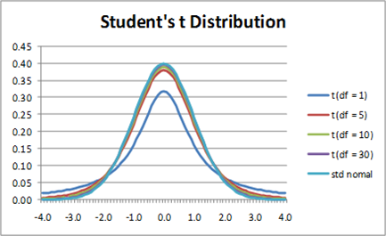

<style>
body {
text-align: justify}
</style>


```{r setup, include=FALSE}
knitr::opts_chunk$set(echo = TRUE)
```

## 1. Ismétlés: Az átlag standard hibája a Balaton átúszás eredményeken

Ugyebár a <a href="Gyak03.html" target="_blank">3. heti tananyagban</a> a 2022-es Balaton átúszás résztvevőinek időeredményeit vizsgáltuk mintavételi és becsléselméleti szempontból elég alaposan. Töltsük is be egy `pandas` data frame-be ismét a <a href="https://github.com/KoLa992/Statisztika-II-Python-Jegyzet/blob/main/LIDLBalaton2022.xlsx" target="_blank">LIDLBalaton2022.xlsx</a> fájl adatait. Ebben az Excelben megvan az összes résztvevő időeredménye a `PERC` oszlopban. Ez az adatsor lesz most nekünk tehát a **sokaságunk**.

```{python}
# Elemzéshez és ábrázoláshoz szükséges csomagok betöltése
import numpy as np
import pandas as pd
import matplotlib.pyplot as plt
import scipy.stats as stats

# Adatbeolvasás data frame-be
Balcsi = pd.read_excel("LIDLBalaton2022.xlsx")

Balcsi.info()
Balcsi.head()
```

Meg is van akkor mind az $N=9751$ részvevőnk. Ebben a tananyagban **most kizárólag az időeredmények átlagának becslésével** fogunk foglalkozni.<br>
Úgyhogy **számoljuk is ki**, hogy az összes átúszó, azaz a **sokaság**, tekintetében mi az **időeredmények átlaga** ($\mu=\bar{Y}$). Ezen kívül majd jól jön még nekünk referenciaként az időeredméynek sokasági **szórása** ($\sigma$) is.

```{python}
SokasagiAtlag = np.mean(Balcsi.PERC)
SokasagiSzoras = np.std(Balcsi.PERC)

SokasagiAtlag
SokasagiSzoras
```

Ezeka alapján tudjuk tehát, hogy egy átlagos Balaton átúszó $\mu=165.5$ perc alatt teljesítette a távot, amitől egy konkrét versenyző saját időeredménye várhatóan $\sigma=44.1$ perccel tér el.

**Az átlag becslése során** az a feladatunk, hogy **ezt a $\mu=165.5$ perces átlagot valahogy "megtippeljük"** egy visszatevéses véletlen (azaz FAE) **minta adatai alapján**.

Tehát, **vegyünk is egy $n=100$ elemű mintát a Balatonátúszók sokaságából** a kedvenc $1992$-es véletlen magunk mellett, és nézzük meg, hogy **mennyi a mintaátlag, azaz $\bar{y}$ értéke**.

```{python}
BalcsiMinta = Balcsi.sample(n = 100, replace = True, random_state = 1992)

MintaAtlag = np.mean(BalcsiMinta.PERC)

MintaAtlag
```

Tehát ebben az $n=100$ elemű **mintában az átlagos átúszási idő $164.4$ perc**. A <a href="Gyak03.html" target="_blank">3. heti tananyagban</a> elvégzett okoskodásunk alapján a **mintaátlag alapján úgy tudjuk lehatárolni a sokasági átlag ($\mu$) értékét, hogy a mintaátlag értékre rámérem $\pm$ annak standard hibáját**. Hiszen a standard hiba megmutatja, hogy egy véletlenszerűen kiválasztott mintavétel átlaga várhatóan mennyivel tér el a valós sokasági átlagtól (mivel a $\bar{y}$ mintaátlag alapból egy torzítatéan becslőfüggvénye a $\mu$ sokasági átlagnak).<br>
A gondolatmenet alapján tehát azt mondhatjuk, hogy a **sokasági átlag várhatóan mintaátlag $\pm$ standard hiba által lehatárolt intervallumban nyugszik**.

Jó hír, hogy ugyebár az **átlag standard hibája sokasági szórás osztva gyök alatt mintaelemszám**, azaz $\frac{\sigma}{\sqrt{n}}$ képlettel számolható, aminek az értékét egy mintavétel alapján is meg tudjuk közelíteni, ha a sokasági szórást, annak torzítatlan becslésével a **korrigált mintaszórás**sal helyettesítjük. Tehát, az **egy szem $n=100$ mintából a standard hiba értéke az $\frac{s}{\sqrt{n}}$ képlettel megközelíthető**.

Ez alapján akkor az alábbi számolást tudjuk elkövetni a mintánkon.

```{python}
n = 100
s = np.std(BalcsiMinta.PERC, ddof = 1) # figyeljünk a korrekcióra!
SH = s/np.sqrt(n)

[MintaAtlag - SH, MintaAtlag + SH]
```

Az eredményünk alapján a valós, sokasági átlag ($\mu$) várhatóan $160.6$ és $168.3$ perc között, azaz a $[160.6,168.3]$ intervallumban helyezkedik el. Nos, **az intervallumos becslésünk helyes is, hiszen a valós sokasági átlag uygebár $\mu=167.5$ perc, ami tényleg benne van a mintánk alapján lehatárolt intervallumban**.

## 2. A mintaátlagok eloszlása

Na jó-jó, egy mintavétel esetén szerencsénk is lehetett. **Mennyire működik ez a standard hibás módszer jól sok-sok $n=100$ mintavétel esetében?** Töltsük csak be egy data frame-be azt a táblát, ami $10000$ db $n=100$ FAE mintavétel adatait tartalmazza! Az átlalam generált Excel, ami tartalmazza a $10000$ minta adatait <a href="https://github.com/KoLa992/Statisztika-II-Python-Jegyzet/blob/main/MintaDataFrame.xlsx" target="_blank">innen</a> érhető el. 

```{python}
MintaVetelek100Elem = pd.read_excel("MintaDataFrame.xlsx")
MintaVetelek100Elem
```

Oké, az eredményből látjuk is, hogy úgy néz ki a data frame, hogy **1 sor tartalmaz 1 db 100 elemű mintát és a mintaelemeket** (tehát a mintába besorsolt versenyző percben mért időeredményét) **az oszlopkban tároljuk**.

Akkor most **minden minta esetében számoljuk ki a $\bar{y} \pm SH$ intervallumot**, és nézzük meg, hogy a valós **sokasági átlag** ($\mu$) **beleesik-e** az intervallumba! Annyi **előnyt is adjunk magunknak, hogy a standard hibát a sokasági szórás, azaz $\sigma$ ismeretében számoljuk ki**. Tehát a $SH = \frac{\sigma}{\sqrt{n}}$ képletet alkalmazzuk. Ugye ez annyiban előny, hogy $\sigma$-t egy db 100 elemű minta vizsgálata esetén NEM ismerjük!<br>
A számolás során figyeljünk arra, hogy a `numpy` függvényeket `axis = 1` paraméterrel hazsnáljuk, hiszen egy db minta elemei a sorokban vannak. Illetve, a számolást mindig szorítsuk le a data frame első $100$ oszlopára, hiszen a data frame oszlopait folyamatosan bővíteni fogjuk!

```{python}
n = 100
SH = SokasagiSzoras / np.sqrt(n)

MintaVetelek100Elem['AtlagAlsoHatar'] = np.mean(MintaVetelek100Elem.iloc[:,0:100], axis = 1) - SH
MintaVetelek100Elem['AtlagFelsoHatar'] = np.mean(MintaVetelek100Elem.iloc[:,0:100], axis = 1) + SH
MintaVetelek100Elem
```

Oké, akkor **meg is vannak** az átlag intervallumos **becslés**ének **alsó-felső határai**. **Számoljuk** akkor **ki a találati arányt**!<br>
A számoláshoz azt a trükköt alkalmazzuk, amit a <a href="Gyak02.html" target="_blank">2. heti tananyagban</a> sütüttünk el: a `AdatokEgyben['Normal'] < 100` parancs egy `bool` tömböt ad vissza, amit összegezve megkapjuk a "*kedvező esetek*", vagyis a $\mu$-t helyesen eltaláló intervallumok darabszámát.

```{python}
MintaVetelekSzama = len(MintaVetelek100Elem)

np.sum((MintaVetelek100Elem['AtlagAlsoHatar'] < SokasagiAtlag) & (MintaVetelek100Elem['AtlagFelsoHatar'] > SokasagiAtlag)) / MintaVetelekSzama
```

Nos, olybá tűnik, hogy a $\bar{y} \pm SH$ módszer csak a **mintavételek kb. $68\%$-ban találja el a valós, sokasági átalgot, azaz $\mu$-t!** Gáz Géza! Azért ennél nagyobb találati arányt szeretnénk! Mondjuk legalább valami $90\%$ környékét.

Ahhoz, hogy megértsük miért alakul gyéren ennek a módszernek találati aránya, **nézzünk csak rá az $\bar{y}$ mintaátlagok hisztogramjára!** Most a hisztogramon nem optimalizálom az osztályközök számát, elfogadom a `numpy` alapbeállításait.

```{python}
MintaVetelek100Elem['MintaAtlagok'] = np.mean(MintaVetelek100Elem.iloc[:,0:100], axis=1)

MintaVetelek100Elem.MintaAtlagok.hist()
```

Hoppácska! Dehát, **ez itt a világ legszebb normális eloszlása!**

Ami azért második elgondolásra **teljesen logikus, mivel a Centrális Határeloszlás Tétel (CHT) dolgozik a háttérben**. Ha nem ugrik be a CHT, akkor vissza az <a href="Gyak01.html" target="_blank">1. heti tananyag 2.4. fejezetéhez</a>! :)

A **CHT** szerint ugyebár ha az **adatsor elemi véletlen hatások összegződéseként állnak elő**, akkor az **adatsor normális eloszlás**t követ. A $\bar{y}$ **mintaátlagok adatsora pedig pont olyan adatsor, ami a CHT feltételnek megfelel!** Hiszen a mintaátlag úgy jön ki, hogy a mintaelemeket összeadom és elosztom a minta elemszámával. **Mivel a mintavétel módja FAE, így biztos lehetek benne, hogy egy mintaelem, az egy véletlen húzás, egy véletlen hatás eredménye. Aztán meg ezeket adom össze**. Végén osztok $n$-bel, de az mindig ugyan annyi, így nem változtat a lényegen.

Ha pedig a **sok-sok mintából számolt átlagok adatsora normális eloszlású, akkor azt is tudom, hogy milyen átlagú és milyen szórású normális eloszlást követ!**

- A **torzítatlanság** miatt tudom, hogy a mintaátlagok átlaga a sokasági átlag, azaz $\mu$.
- Mintaátlagok szórása pedig ugye nem más, mint a **standard hiba**, tehát $\frac{\sigma}{\sqrt{n}}$

Szumma szummárom, akkor a **sok-sok mintából számolt mintaátlagok $\bar{y}$ adatsora az alábbi eloszlást követi**: $$\bar{y} \sim N\left(\mu,\frac{\sigma}{\sqrt{n}}\right)$$

Ezt az illeszkedést simán letesztelhetjük grafikusan is az <a href="Gyak01.html" target="_blank">1. heti tananyag 2.3. fejezetében</a> látott módon.<br>
Figyeljük meg, hogy a `stats` csomag `norm.pdf` függvényében az átlagot a korábban kiszámolt `SokasagiAtlag`, a szórást pedig a szintén az előbb kiszámolt `SH` objektumok segítségével adom meg!

```{python}
MintaVetelek100Elem.MintaAtlagok.hist(density = True)
x_tengely = np.arange(np.min(MintaVetelek100Elem.MintaAtlagok), np.max(MintaVetelek100Elem.MintaAtlagok), 0.01)
y_tengely = stats.norm.pdf(x = x_tengely, loc = SokasagiAtlag, scale = SH)
plt.plot(x_tengely, y_tengely)
plt.show()
```

Nagyon szép, az illeszkedés, olybá tűnik a **CHT ismét működik**! :)

## 3. A sokasági átlag konfidencia-intervalluma

Nézzük akkor meg **mi a valószínűsége, hogy egy véletlenszerűen kiválasztott érték egy $N(\mu, SH)$ eloszlásban a $\mu \pm SH$ intervallumba esik!**

```{python}
stats.norm.cdf(x = SokasagiAtlag + SH, loc = SokasagiAtlag, scale = SH) - stats.norm.cdf(x = SokasagiAtlag - SH, loc = SokasagiAtlag, scale = SH)
```

Hoppáré! Ez is éppen kb. $68\%$! Tehát, **az, hogy egy $\bar{y} \pm SH$ becslés csak a mintavételek $68\%$-ban pontos nagyjából egy valószínűségszámítási szükségszerűség**.

Kérdés, hogy **mit tehetünk ez ellen? Mihez kezdhetünk, ha mondjuk nem $68\%$-os, hanem valami jobb, mondjuk $95\%$-os megbízhatóságú intervallumbecslést szeretnénk adni a sokasági átlagra (vagy más néven sokasági várható értékre)?**

Az okoskodáshoz az <a href="Gyak01.html" target="_blank">1. heti tananyag 2.6. fejezetére</a> fogunk támaszkodni.

Ugyanis azt tudjuk, hogy ha a **mintaátlagok eloszlása** az alábbi: $$\bar{y} \sim N\left(\mu,\frac{\sigma}{\sqrt{n}}\right)$$

Akkor a **standardizált/normalizált mintaátlagok eloszlása pedig standard normális eloszlású lesz**: $$\frac{\bar{y}-\mu}{\frac{\sigma}{\sqrt{n}}} = z \sim N(0,1)$$

**Standard normális eloszlás esetén** pedig **mindig igaz**, hogy $P(-2<z<+2) \approx 95\%$. Emlékeztetőként itt az ábra az $N(0,1)$ standard normális eloszlás sűrűségfüggvényéről az 1. heti tananyag 2.6. fejezetéből.

<center>
{width=50%}
</center>

<br>Most az egyszerűség miatt vegyük a $\approx$-ot $=$-nek: $$P(-2<z<+2) = 95\%$$

Ebbe a **fenti összefüggésbe beírjuk a képletet, amivel kiszámoltuk $z$-t**: $$P\left(-2< \frac{\bar{y}-\mu}{\frac{\sigma}{\sqrt{n}}} <+2\right) = 95\%$$

Most egyelőre azzal a feltevéssel élünk, hogy ismerjük $\sigma$-t, azaz a sokasági szórást. Mondjuk pl. valami előzetes teljeskörű adatfelvételből. Célunk, hogy a valós, sokasági átlagot ($\mu$-t) foglaljuk valamiféle határok közé egy darab mintaátlag ($\bar{y}$) ismeretében (hiszen majd nem akarjuk mindig kivenni az összes lehetséges mintát). Tehát, az összefüggésből fejezzük a $\mu$ sokasági átlagot: $$P\left(\bar{y}-2 \times \frac{\sigma}{\sqrt{n}}< \mu <+2 \times \frac{\sigma}{\sqrt{n}}\right) = 95\%$$

Tehát, ez a fenti összefüggés azt jelenti, hogy a **sokasági átlag az egy darab mintaátlag $\pm 2SH$ intervallumban van kb. $95\%$-os valószínűséggel**. Ezt hívjuk az **átlag 95%-os konfidencia-intervallumának**. A $2$ pedig a $95\%$-os megbízhatósági szinthez tartozó $k$ **megbízhatósági szorzó**. Mindezeket pedig csupán egy darab $n$ elemű mintából ki is tudjuk számolni, ha $\sigma$-t helyettesítjük $s$-sel! Viszont **fontos, hogy a mintánkat véletlenszerűen válasszuk ki, mert csak így kapunk a mintaátlagok eloszlására a látott normális eloszlást!** Ugyebár a CHT-nak kellenek a véletlen kiválasztású mintaelemek a "*véletlen hatások összegződése*" részhez.

### 3.1. Az átlag konfidencia-intervallumának általános alakja

Ha **átalánosságban akarjuk felírni ezt a konfidencia-intervallumot**, akkor úgy szoktunk fogalmazni, hogy $1-\alpha$ **megbízhatóságú intervallum**ot írunk fel, ahol $\alpha$ a **hibázásunk valószínűsége**, tehát, annak a valószínűsége hogy a sokasági átlag *mégsem* a konfidencia-intervallumban van: $$P\left(\bar{y}-z_{1-\frac{\alpha}{2}} \times \frac{\sigma}{\sqrt{n}}< \mu <+z_{1-\frac{\alpha}{2}} \times \frac{\sigma}{\sqrt{n}}\right) = 1- \alpha$$

Itt a $z$ érték azt akarta jelenteni, hogy azt a $z$ **értéket kell levadászni, ami esetén az "alá esés" valószínűsége a standard normális eloszlásban épp** $1-\frac{\alpha}{2}$.<br>
Ennek okát szemlélteti az alábbi ábra.

<center>
{width=60%}
</center>

<br>Ugyebár a cél az, hogy a $z \sim N(0,1)$ eloszlásban megtaláljuk azt a $k$ értéket, ahol $P(-k < z < +k)=1-\alpha$. Ugyebár a $95\%$ esetén is innen kaptuk a $2$-t. Ezt pedig akkor úgy kapjuk meg a **fenti ábra alapján**, hogy ha tudjuk, hogy a $\pm k$ közé esés valószínűsége $1- \alpha$, akkor a tartományon **kívülre esés valószínűsége** $\alpha$, a hibázásunk megengedett valószínűsége. Ami a normális eloszlás sűrűségfüggvényének **szimmetriája miatt egyenlően oszlik el** $-k$ alá és $+k$ felé. Tehát a $+k$ felé esési valószínűsége $\alpha / 2$. De mivel a pitonban a `stats` csomag `norm.ppf` függvénye **csak "alá esési" valószínűségekből dolgozik**, így a $+k$ alá esés valószínűséget kell tudnunk, ami a felé esés komplementere, azaz $1-\frac{\alpha}{2}$, ami az **ábrán a narancssárga rész területe a sűrűségfüggvényben**.

Láthatjuk a logika szuperül működik a $95\%$-os megíbzhatóság, azaz $\alpha=5\%$ esetére.

```{python}
alfa = 0.05

stats.norm.ppf(1-(alfa/2))
```

Az eredmény nem pontosan $2$, hanem kb. $1.96$. Ugyebár a **levezetésben kerekítettem**, de a megbízhatósági szorzó számítás lényege szerintem átjött. :)

**Szumma-szummárum**. Az **átlag tetszőleges megbízhatóságú intervallumbecslése / konfidencia-intervalluma általános alakban a következő módon számítható**: $$\bar{y} \pm k \times SH$$

Tehát, a **mintaátlagra ($\bar{y}$) rámérjük $\pm$ a standard hiba $k$-szorosát, ahol a $k$, mint megbízhatósági szorzó állítja be a kívánt megbízhatósági szintet**.<br>
Ez az **általános formula azért nagyon fontos, mert a későbbiekben az átlagra vonatkozó becslések során mindig csak annyit változtatunk rajta, hogy az $SH$ és a $k$ mögött álló konkrét képlet fog csak változni, de ez a fenit alaplogika végig megmarad!!**

### 3.2. A konfidencia-intervallum megbízhatóságának ellenőrzése

Utolsó lépésben ellenőrizzük le konfidencia-intervallumos formulánk működését, és **nézzük meg, hogy a $\sigma$-val számolt $SH$-t használva** tudunk-e **egy $98\%$-os megbízhatóságú intervallumbecslés**t készíteni a Balatont átúszók időeredméyneinek átlagára a $k=z_{1-\frac{\alpha}{2}}$ megoldásunkkal.

Tehát a $10000$ db mintánk **mintaátlagára a mostani helyzetben** a $$\triangle = k \times SH = z_{1-\frac{\alpha}{2}} \times \frac{\sigma}{\sqrt{n}}$$

távolságot kell $\pm$ felmérni. Ezt a $\triangle$ távolságot hívjuk a **konfidencia-intervallum hosszának, vagy másképp a becslés teljes hibahatárának**.

Nézzük akkor meg, hogy egy **ilyen becslés tényleg kb. $98\%$-os találati arányt eredményez-e?**

```{python}
n = 100
alfa = 1 - 0.98
k = stats.norm.ppf(1-alfa/2)
SH = SokasagiSzoras / np.sqrt(n)
delta = SH * k

MintaVetelek100Elem['AtlagAlsoHatar'] = MintaVetelek100Elem['MintaAtlagok'] - delta
MintaVetelek100Elem['AtlagFelsoHatar'] = MintaVetelek100Elem['MintaAtlagok'] + delta
MintaVetelek100Elem.iloc[:,99:103]
```

Oké, akkor **megvannak az új intervallumbecsléseink** mind a $10000$ mintára. Lássuk a pontosságukat!

```{python}
MintaVetelekSzama = len(MintaVetelek100Elem)

np.sum((MintaVetelek100Elem['AtlagAlsoHatar'] < SokasagiAtlag) & (MintaVetelek100Elem['AtlagFelsoHatar'] > SokasagiAtlag)) / MintaVetelekSzama
```

És **tényleg kb. $98\%$ a találati arány**, győzelem! :)

### 3.3. A konfidencia-intervallum két fontos tulajdonsága

A konfidencia-intervallum **megbízhatósági szintjével csínján kell bánni**. Ha megfigyeljük a korábbi számításainkat, akkor láthatjuk, hogy

- $95\%$-os megbízhatósághoz $k=1.96$
- $98\%$-os megbízhatósághoz viszont már $k=2.3$

megbízhatósági szorzó tartozik.

A $\triangle = k \times SH$ összefüggés miatt pedig könnyű látni, hogy **megbízhatósági szint növelésével a becslési hibahatár nő, azaz a konfidencia-intervallum tágul**. Teljesen logikus: ha **nagyobb találati arányt akarok, akkor "növelni kell a hálót", így nagyobb eséllyel akad fenn rajta a sokasági átlag**.<br>
$100\%$-os megbízhatóság pedig egy esetben van, ha az intervallumbecslésünk a $\pm \infty$ tartomány, ami ugyebár nem túl hazsnos becslési intervallum... :)

Érdemes kipróbálni a dolgot még az *1. fejezetben* kivett $100$ elemű mintán mondjuk $\alpha=\{0.2,0.1,0.05,0.01,0.001\}$ hibavalószínűségek mellett egy `for` ciklussal.<br>
A számoláshoz felhasználom a korábban kiszámolt `MintaAtlag` és `SH` objektumokat.

```{python}
alfa_lista = [0.2, 0.1, 0.05, 0.01, 0.001]

for aktualis_alfa in alfa_lista:
  also_hatar = MintaAtlag - SH * stats.norm.ppf(1-aktualis_alfa/2)
  felso_hatar = MintaAtlag + SH * stats.norm.ppf(1-aktualis_alfa/2)
  print(
    "Megbízhatóság: "+str((1-aktualis_alfa)*100)+"% - Konf. Int.: ["+
    str(round(also_hatar,2))+", "+str(round(felso_hatar,2))+"]")


```

Szépen megfigyelhető a leírt jelenség: **a megbízhatóság növelésével a konfidencia-intervallum egyre csak tágul, azaz a becslési hibahatár folyamatosan nő**.

- $90\%$ megbízhatóság esetén az átlagos időeredményt még valahova $157$ és $172$ perc közé tippeljük,
- $99\%$ megbízhatóságnál viszont már $153$ és $176$ perc közé!

A jelenséget mérsékelni a **mintaelemszám növelésével lehet**! **Nézzük meg az előző `for` ciklust egy $n=20$ elemű mintán az $n=100$ helyett!** Számoljuk ki az első 20 oszlop alapján a $\bar{y}$ mintaátlagot. Mivel a kiválasztás FAE volt, így olyan lesz a dolog, mintha csak 20 elemet választottunk volna ki a mintavétel során, nem pedig 100-at. Az $SH=\frac{\sigma}{\sqrt{n}}$ is könnyen újraszámolható $n=20$ mellett.

```{python}
MintaAtlag20Elem = np.mean(BalcsiMinta.PERC[0:20])
n = 20
SH20Elem = SokasagiSzoras / np.sqrt(n)

alfa_lista = [0.2, 0.1, 0.05, 0.01, 0.001]

for aktualis_alfa in alfa_lista:
  also_hatar = MintaAtlag20Elem - SH20Elem * stats.norm.ppf(1-aktualis_alfa/2)
  felso_hatar = MintaAtlag20Elem + SH20Elem * stats.norm.ppf(1-aktualis_alfa/2)
  print(
    "Megbízhatóság: "+str((1-aktualis_alfa)*100)+"% - Konf. Int.: ["+
    str(round(also_hatar,2))+", "+str(round(felso_hatar,2))+"]")


```

Szépen láthatjuk, hogy az **átlagos átúszási időket $99\%$-os megbízhatósággal**

- $n=20$ esetben $140$ és $191$ perc közé tesszük,
- $n=100$ esetben pedig láttuk az előbb, hogy a becslés pontosabb (kisebb $\triangle$ hibahatárú): $153$ és $176$ perc közé teszi a sokasági átlagidőt.

Nem meglepő az eredmény. Mivel a $\frac{\sigma}{\sqrt{n}}$ standard hiba **képlet nevezőjében van az $n$ elemszám, így növelése csökkenti a standard hibát, ezen keresztül pedig a teljes $\triangle$ becslési hibahatárt**. Ugyebár a <a href="Gyak03.html" target="_blank">3. heti tananyagban</a> megállapítottuk, hogy az átlag **konzisztens becslés**: elemszám növekedésével a $SH$-ja csökken, a $0$-ba tart.

Emiatt a **választott $1-\alpha$ megbízhatósági szint a mintaelemszám függvénye**:

- Nagyobb $n$ elemszám esetén egy $99\%$-os megbízhatóság is elég pontos intervallumbecslést szolgáltathat,
- Kisebb mintaméret esetén valószínűleg meg kell elégedni valami moderáltabb (pl. $90\%-95\%$) megbízhatósági szinttel is.

## 4. Intervallumbecslés a gyakorlatban

Ezen a ponton **engedjük el a Balaton átúszókat**, és **próbáljuk ki az átlag konfidencia intervallum számítást olyan esetben, ahol nem ismerjük a teljes sokaságot, amiből mintát vettünk**.

### 1. feladat: Altatók hatékonysága

A sztorink a következő.

Egy gyógyszergyár egy új altató készítmény hatását vizsgálja $10$ véletlenszerűen kiválasztott inszomniában szenvedő páciensen. Mind a tíz páciens esetében feljegyezték, hogy hány órát növekedett az alvásidejük a készítmény használatát követően. Korábbi klinikai vizsgálatok alapján ismeretes, hogy az altató készítmények által kiváltott alvásidő-változás normális eloszlású, $2$ óra szórással.												

$Adatok = \{1.9, 0.8, 1.1, 0.1, -0.1, 4.4, 5.5, 1.6, 4.6, 3.4\}$

Készítsünk $95\%$-os megbízhatósággal intervallumbecslést a várható átlagos alvásidő-változásra:

a) a megadott feltételek alapján;
b) feltételezve, hogy az eloszlás normális, de a szórás ismeretlen!
c) Mekkora mintára van szükség, ha ugyan ekkora megbízhatóság (95%) mellett a b) pontban kapott hibahatárt a felére kívánjuk csökkenteni?

### 1/a) feladat megoldás

Ebben az a) feladatban nagyon el vagyunk kényeztetve. Az altató hatékonyságához van egy $n=10$ elemű mintánk, aminek az adatait tételesen ismerjük. Első páciens alvásideje $1.9$ órával nőtt az altató használata után, másodiké $0.8$ órával, stb. Van egy páciens, akinek csökkent az alvásideje a gyóygszerhasználat után: az 5. delikvensé, $0.1$ órával.<br>
Ha ezeket az adatokat elrakjuk egy `numpy` tömbbe, akkor simán kiszámolható a megfigyelt 10 páciens esetében az átlagos alvásidő növekedés, azaz $\bar{y}$

```{python}
MintaAdatok = np.array([1.9, 0.8, 1.1, 0.1, -0.1, 4.4, 5.5, 1.6, 4.6, 3.4])
MintaAtlag = np.mean(MintaAdatok)
MintaAtlag
```

Tehát a megfigyelt páciensek esetében az átlagos alvásidő növekedés kb. $\bar{y}=2.3$ óra. Ami szép és jó, de mennyi lehet az **átlagos alvásidő növekedés az inszomniás páciensek összességére, a teljes sokaságra nézve? Ehhez kell a konfidencia-intervallum! Hogy olyan betegekre is tudjunk mondani valamit, akiket a mintában NEM figyeltünk meg!**

Itt az a) esetben minden **feltételezést elfogadhatunk, amit a feladat tesz**. Ebben van egy olyan rész, ami szerint "*korábbi kutatásokból*" ismerjük, hogy az alvásidő-változások szórása $2$. Ha ezt így elhisszük, akkor azt mondhatjuk, hogy az alvásidő-változások teljes sokaságra vonatkozó szórását vehetjük $2$-nek. Azaz, $\sigma=2$-t "*hazudunk*" a számolások során.<br>
**FIGYELEM!** Ha a feladat szövege azt akarja közölni velünk, hogy van egy sokasági szórás, egy $\sigma$, amit ismerünk és használhatunk a számolásaink során, akkor azt mindig ilyen "*korábbi kutatásokból ismeretes...*" szövegrészbe fogja becsomagolni!

Ha **elfogadjuk a feltételezéseinket, akkor minden adott a konfidencia-intervallum 3. fejezetben megismert képletének alkalmazásához**. Hiszen, ha $95\%$ a megbízhatóság, akkor $\alpha=5\%$. Tegyük is ezt: alkalmazzuk a képleteket az adatainkra!

```{python}
n = 10
alfa = 1-0.95
szigma = 2

k_szorzo = stats.norm.ppf(1-alfa/2)
SH = szigma/np.sqrt(n)
delta = k_szorzo*SH

also = MintaAtlag - delta
felso = MintaAtlag + delta

[also, felso]
```

Az eredmény alapján ez az **új alatató készítmény az inszomniás páciensek teljes sokaságában a 10 elemű mintánk alapján legalább $1.09$ óra és legfeljebb $3.6$ óra alvásidő növekedést okoz $95\%$-os valószínűséggel!**

Ennek a cég vezetése nagyon örül, mert lehet olyan reklámszlogeneket elsütni az eredményünk alapján, hogy "*vizsgálatok igazolják, hogy altatónk $95\%$-os valószínűséggel legalább $1$ órával növeli a várható alvásidőt*". Egy ilyen mondat pedig minden marketinges álma *úgymond*. :)

De **minden ilyen szép marad-e ha az alvásidők szórását nem a feltételezett** $\sigma=2$-vel, hanem a **mintából számolt korrigált szórással ($s$) számítjuk?**

### 1/b) feladat megoldás

Itt a feladat azt mondja, hogy ne higyjünk mindenféle kétes "*korábbi kutatásnak*", ne fogadjuk el az általuk megadott $\sigma$-t, hanem **számoljunk magunknak egy korrigált mintaszórást**, azaz $s$-t (a korrigált mintaszórás ad torzítatlan becsést a valós, sokasági $\sigma$-ra), és számoljuk végig azzal a stanadard hibát $SH=\frac{s}{\sqrt{n}}$ módon.

Viszont, ha **feloldjuk azt a feltevésünk, hogy ismerjük a sokasági szórást az $SH$ számoláshoz** , akkor a **mintaátlagok normális helyett egy $n-1$ szabadságfokú t-eloszlást követnek**.

A **t-eloszlás sűrűségfüggvénye az alábbi alakot ölti**. Az szabadságfokokat az angol *degrees of freedom* kifejezésből $df$-el jelöljük.

<center>
{width=60%}
</center>

<br>Ahogy a fenti sűrűségfüggvényből is létszik Student-féle t-eloszlás valójában egy **ellapított standard normális eloszlás** (lásd fenti ábra). A lapítás azt akarja kifejezni, hogy az eloszlás szórása nagyobb. Hiszen nagyobb szórás esetén az eloszlás szélein lévő számértékek is nagyobb valószínűséggel következhetnek be (mivel a lapítás miatt a sűrűségfüggvény magasabban fut ezeken a helyeken), így változatosabbá, jobban szóródóvá teszik az adatsorunk.

Viszont, ahogy növeljük az eloszlás szabadságfokát ($df$), egyre jobban "*visszacsúcsosítjuk*" az eloszlást a standard normális eloszlásba. Logikus, hogy ilyenkor ezt az eloszlást használjuk, mivel a standard hiba értékébe (ami a mintaátlagok normális eloszlásának szórás paramétere) egy biztosan ismert sokasági szórás érték helyett, annak egy mintából számított becslését rakjuk, így **nagyobb bizonytalanságot, nagyobb szórást viszünk az eloszlásba**.

Ebben a helyzetben a konfidencia-intervallum úgy módosul, hogy $\sigma$ helyére $s$ kerül a $SH$-ban, és a $k$ megbízhatósági szorzót $t$-eloszlásból számoljuk $N(0,1)$ eloszlás helyett: $$P\left(\bar{y}-t_{1-\frac{\alpha}{2}}^{n-1} \times \frac{s}{\sqrt{n}}< \mu <+t_{1-\frac{\alpha}{2}}^{n-1} \times \frac{s}{\sqrt{n}}\right) = 1- \alpha$$

Az $n-1$ szabadságfokú $t$ érték számításához a `scipy` csomag `t.ppf` függvényét vesszük elő. Teljesen hasonló logikával működik, mint a `norm.ppf` függvény (vagy mint a  `scipy` bármelyik eloszlás inverz értékét számoló függvénye). A $t$-eloszlás is szimmetrikus, tehát most is azt az értéket keressük az $n-1$ szabadságfokú $t$-eloszlásunkban, ahol az "*alá esési*" valószínűség $1-\frac{\alpha}{2}$. A `t.ppf` függvény `df` paraméterével állítható a szabadságfok.<br>
Ezt a mi $n=10$ elemű mintánkra, $95\%$-os megbízhatósági szint mellett az alábbi módon számoljuk

```{python}
n = 10
alfa = 1-0.95

k_szorzo_z = stats.norm.ppf(1-alfa/2)
k_szorzo_t = stats.t.ppf(1-alfa/2, df = (n-1))

[k_szorzo_z, k_szorzo_t]
```

Láthatjuk, hogy **a $t$-eloszlású $k$ szorzó értéke érdemben nagyobb, mint a standard normális eloszlású $k$ szorzóé ugyan arra a megengedett hibavalószínűségre**! Mivel a $t$-eloszlás nagyobb valószínűséget tulajdonít az extrém magas+alacsony értékek bekövetkezésének, így ha ezt alkalmazzuk, akkor ugyan ahhoz a megbízhatósági szinthez egy magasabb $k$ megbízhatósági szorzót kapunk a $SH$-hoz!

Ezek után igazából csak annyi a feladatunk, hogy a teljes becslési hibahatárt kiszámítsuk $\triangle = t_{1-\frac{\alpha}{2}}^{n-1} \times \frac{s}{\sqrt{n}}$ módon, és ezt rámérjük $\pm$ a mintaátlagra, $\bar{y}$-ra. Ez már mehet ugyan úgy, mint az a) feladatban.

```{python}
korr_szoras = np.std(MintaAdatok, ddof = 1)

k_szorzo_t = stats.t.ppf(1-alfa/2, df = (n-1))
SH = korr_szoras/np.sqrt(n)
delta = k_szorzo_t * SH

also = MintaAtlag - delta
felso = MintaAtlag + delta

[also, felso]
```

Nem meglepő módon, a **t-eloszlású megbízhatósági szorzó miatt a $95\%$-os kinfidencia-intervallum kitágult**. Annak ellenére is, hogy az $SH$-ban gyakorlatilag nincs változás, mivel $s=2.0022$. Az altató átlagos alvásidő növekedése a betegek teljes sokaságban, már $0.9$ és $3.76$ óra közé tehető $95\%$-os valószínűséggel. Szóval, ebben a reálisabb helyzetben, amikor már a szórást magunknak számoljuk a mintaadatokból, és nem pedig "*elhisszük*" valakinek, akkor a bizonytalanság megnövekedése miatt alkalmazott t-eloszlásnak köszönhetően, a becslési hibahatár, a $\triangle$ kitágul. A marketingesek pedig már nem mondhatnak olyan szépeket, hogy "95%-os valószínűséggel legalább átlag $1$ órát növeli az alvásidőt az altató". RIPSZ! :(

Viszont, amíg a **mintánk elemszámi kicsi**, $n \leq 30$, addig a **t-eloszlású konfidencia intervallum számításának van egy előfeltétele: az adatsor, amiből a mintát vesszük normális eloszlású kell, hogy legyen!!**<br>
Esetünkben ez annyit tesz, hogy az inszomniás páciensek sokaságában az *alvásidő normális eloszlású* hisztogramot mutat.

Na, most itt ezt kemény $n=10$ esetben marha nehéz értelmesen megvizsgálni a minta alapján, de lessünk egy hisztogramot a megfigyelt $10$ db alvásidőre! A hisztogram osztályközeinek számát most nem optimalizáljuk, elfogadjuk az alapbeállításokat.

```{python}
plt.hist(MintaAdatok)
plt.show()
```

Hát, a fene se tudja ennyiből eldönteni, de tényleg. Akár normális eloszlásúak lehetnek az alvásidők. :) Bízzunk a *CHT*-ben: az egyéni alvásidők valószínűleg véletlen hatások összegeként állnak elő, így azok adatsora a sokaságban, a nem megfigyelt $10$ elemű mintán *kívüli* világban, lehet normális eloszlású is akár. :)

Maga a *t-eloszlás* egyébként egy *William Gosset* nevű angol statisztikus kreatúrája. Mr. Gosset a *Guiness* sörgyárak minőségbitosítási vezetője volt, és azt a feladatot kapta, hogy oldja meg, hogy az üveges sörök minőségbiztosítása kis mintákból is megoldható legyen. Mivel a minőségbiztosításhoz ki kell bontani az üveget és megmérni benne az összetevőket, aztán utána ezek átlagára néznek konfidencia-intervallumokat. A minőségbiztosításra kinyitott sör pedig már nem elfogyasztható. *Kellemetlen*.<br>
Így érhető, hogy minél kevesebb üvegből akarják az egész minőségbiztit megúszni. Erre adta megoldásként Gosset a t-eloszlást. Mivel a sörökben a különböző alapanyagok értéke normális eloszlást követ.

Azonban emberünk el akart büszkélkedni a saját kis elszlásával a nagy világban, ezért *Student álnéven* publikálta is az eredményeit...innen lett az eloszlás neve *Student-féle t-eloszlás*. :) Viszont nagyon nem volt előrelátó az úriemberünk, hiszen akkoriban nyilván csak a Guiness sörgyár tudott elég kevés üvegből ugyan olyan "jó" megbízhatósággal minőségbiztosítani, mintha több elemű mintát vizsgáltak volna, így *Mr. Gosset* gyorsan lebukott.

Tehát, ahogy az alábbi ábra is mutatja, szegény emberünk csak a sörtermelést szerette volna hatékonyabbá tenni, de végül mindenki életét tönkretette, aki statisztikai becsléselméletet tanul. :)

<center>
{width=30%}
</center>

### 1/c) feladat megoldás

Node, térjünk vissza az altató készítményünk hatékonyságára. Ugyebár a t-eloszlással készített konfidencia-intervallum eléggé elkeserítő eredményt hozott: nem tudjuk azt mondani $95\%$-os megbízhatósággal, hogy készítményünk legalább $1$ órával növeli az alvásidőt!

Mi ennek az oka? Hát a **magas becslési hiba, az átlagra épített konfidencia-intervallum hossza**, tehát a $\triangle$. Ez most ugye nekünk $\pm 1.43$ óra.

```{python}
delta
```
Mondjuk ezt a becslési **hibahatárt szeretnénk levinni a felére**, $1.43/2$, azaz kb. $\triangle'= \pm 0.7$ órára. Ezt kétféleképpen lehet elérni. Hiszen "*magasról nézve*", a becslési hibahatár egy kéttényezős szorzat $$\triangle=k \times SH$$

1. Addig állítgatom a megbízhatósági-szintet, azaz valójában $\alpha$-t, amíg a t-eloszlásból származó $k$ megbízhatósági szorzó olyan alacsony nem lesz, hogy az eddigi $SH$-val szorozgatva ki nem adja a $0.7$-es értéket $\triangle$-re. Ez az **illetlen megoldás**! Hiszen lehet, hogy ehhez az $\alpha$-t nagyon fel kell engedni, és a becslésnek nagyon alacsony lesz a megbízhatósága...az "$55\%$-os megbízhatósággal állítható az, hogy..." nem hangzik olyan jól marketing szempontból sem.

2. Az **intelligens megoldás** a mintaelemszám, azaz $n$ növelése. Az $\alpha$-t adottnak vesszük, és így $k$-t nem bántjuk. Persze a t-eloszlás szabadságfoka miatt az elemszám $k$-ra is hat, de ahogy az eloszlás sűrűségfüggvényéből is látszik, kellően nagy $n$ esetén a t-eloszlás igazából a standard normálissal lesz ekvivalens, tovább tehát nem tudjuk csökkenteni $k$-t adott $\alpha$ mellett. Tehát ekkor a $k$ lényegében fix. Ellenben $n$ növekedése miatt az $SH$ része a szorzatnak biztosan csökkeni fog, hiszen az átlagra konzisztens becslést adunk, tehát $SH$ a $0$-ba tart $n$ növelése esetén. Ez ugye a $SH=\frac{s}{\sqrt{n}}$ összefüggésből adódik egyértelműen. Szóval az $s$-t (vagy éppen $\sigma$-t, ha azt ismerjük) adottnak vesszük, akkor kiszámolhatjuk, hogy mekkora $n$ szükséges a $\triangle'= \pm 0.7$ óra eléréséhez hibahatár fronton.

Szóval, a 2. megoldást, az elemszám növelését választva a következő összefüggésből ki kell fejezni $n$-t: $$\triangle=k \times SH = z_{1-\frac{\alpha}{2}} \times \frac{s}{\sqrt{n}}$$

Hiszen $\triangle$ helyére beírhatjuk nemes egyszerűséggel az elérni kívánt $\triangle$-t. A $k$ helyére azért írtam $z_{1-\frac{\alpha}{2}}$-t és nem a t-eloszlású szprzót, mert a standard normális eloszlású megbízhatóságú szorzó értéke alá úgysem tudunk menni a t-eloszlással adott $\alpha$ mellett, hiszen a t-elsozlású sűrűségfüggvényt végtelen szabadságfok mellett is csak a standard normális eloszlásba lehet maximum "*visszacsúcsosítani*", ahogy a b) feladat megoldásában szereplő ábrán láthattuk is.

Ha pedig a fent formulából kifejeztük az elemszámot, akkor ehhez az összefüggéshez jutunk: $$n=\frac{z_{1-\frac{\alpha}{2}}^2 \times s^2}{\triangle^2}$$

Ebbe pedig gond nélkül be tudunk helyettesíteni mindent.

```{python}
delta_uj = 0.7

n_uj = k_szorzo_z**2 * korr_szoras**2 / delta_uj**2
n_uj
```

Tehát a becslési ha felezéséhez $n=31.4$ elemű minta kéne... mivel egyik betegből sem vágnánk ki $0.4$ részt a vizsgálatra, így logikus módon az eredményt kerekítsük fel $n=32$-re. **Azaz, $32-10=22$ páciensen kéne még  extrában megvizsgálni az altató hatását ahhoz, hogy az átlagos alvásidő növekedést $95\%$-os megbízhatósággal és $\pm0.7$ órás becslési hibával meg lehessen adni**.<br>
Persze, ha a mintaátlag vagy éppen a korrigált mintaszórás úgy módosul az új mintaelemek hatására, hogy a konfidencia-intervallum alsó határa továbbra sem éri el a vágyott $1$ órát, akkor tervünk dugába dőlt. Viszont, akkor ez inkább a gyógyszert fejlesztő vegyészek sara, mint a hatékonyságvizsgálatot végző statisztikusé, aki rávilágít a problémákra. :)

### 2. feladat

Az <a href="https://github.com/KoLa992/Statisztika-II-Python-Jegyzet/blob/main/ESS2020.xlsx" target="_blank">ESS2020.xlsx</a> fájlban található adatbázis a 2020-ban végzett európai szociális felmérés (European Social Survey 2020 = ESS2020) 1849 magyar kitöltöjének válaszait tartalmazza 14 kérdésre (plusz van egy *id* oszlop).

Ha valamelyik oszlopban üres értéket találunk, akkor az adott sorban lévő kitöltő nem válaszolt a kérdésre. Az adatbázisban szereplő kitöltők a teljes 18 év feletti magyar népességből vett véletlen mintaként kezelhetők. Most feltesszük, hogy ez a véletlen minta visszatevéses, azaz $FAE$ is. A 6. heti tananyagban látni fogjuk, hogy ez nem is valóságtól elrugaszkodott feltevés.

Az adatbázis nyers formában <a href="https://ess-search.nsd.no/en/study/172ac431-2a06-41df-9dab-c1fd8f3877e7" target="_blank">eről a linkről</a> elérhető egy ingyenes regisztráció után.

**Feladatunk** a mintavétel alapján megbecsülni, hogy hogy egy átlagos magyar polgár $97\%$-os megbízhatósággal várhatóan legalább és legfeljebb hány percet internetezik naponta!

### 2. feladat megoldás

Először is töltsök be az adatbázist `pandas` data frame-be és nézzük meg az elemszámot a feladat szempontjából releváns `NetUsePerDay_Minutes` oszlopban!

```{python}
ESS = pd.read_excel("ESS2020.xlsx")
ESS.info()

n = ESS.NetUsePerDay_Minutes.count() # így nem számoljuk be az üres értékeket
n
```

Szóval, az üres értékeket nem számolva, a releváns oszlop `count` metódusával megtudhattuk, hogy az internetezési idő esetében $n=1099$ elemű mintából főzhetünk. **Ez bőven nagy minta**, mivel ebből a tárgyból közmegegyezéssel **az $n > 30$ eseteket nagy mintának tekintjük**, ahogy az 1/b) feladat megoldásában megadtuk. Emiatt **nem kell az intrenetezési idők normális eloszlását sem vizsgálni az intervallumbecslés elvégzéséhez $s$-t és t-eloszlást használva**!

Mehetünk simán előre a $\triangle = t_{1-\frac{\alpha}{2}}^{n-1} \times \frac{s}{\sqrt{n}}$ képletet használva.

```{python}
n = ESS.NetUsePerDay_Minutes.count() # így nem számoljuk be az üres értékeket

minta_atlag = np.mean(ESS.NetUsePerDay_Minutes)
korr_szoras = np.std(ESS.NetUsePerDay_Minutes, ddof = 1)

SH = korr_szoras / np.sqrt(n)

alfa = 1-0.97
k_szorzo_t = stats.t.ppf(1-alfa/2, df = (n-1))

delta = k_szorzo_t * SH

also = minta_atlag - delta
felso = minta_atlag + delta

[also, felso]
```

Tehát, az $n=1099$ elemű mintánk alapján azt mondhatjuk, hogy az átlagos magyar $97\%$-os megbízhatósággal legalább napi $171.8$ percet és legfeljebb napi $190.8$ percet tölt internetezéssel.

Az eredményünk nem nagyon változik, ha a $k$ megbízhatósági szorzót standard normális eloszlásból számoljuk t-eloszlás helyett, hiszen az $n$ olyan nagy, hogy az $n-1$ szbadságfokú t-eloszlás sűrűségfüggvénye lényegében semmiben nem fog különbözni a standard normális eloszlás sűrűségfüggvényétől.

```{python}
alfa = 1-0.97
k_szorzo_z = stats.norm.ppf(1-alfa/2)

delta = k_szorzo_z * SH

also = minta_atlag - delta
felso = minta_atlag + delta

[also, felso]
```

Láthatjuk, hogy csak a tizedesjegyekben vannak nagyon minimális eltérések. Szóval **nagy mintaelemszám esetén a megbízhatósági szorzó nyugodtan számolható standard normális eloszlásból is a t-eloszlás helyett**.

Szerencsénkre, a `scipy` csomagban az átlag konfidencia-intervallumának számítására standard normális és t-eloszlású $k$ szorzók esetében is **vannak beépített függvények**.<br>
Ezek értelemszerűen `stats.norm.interval` és `stats.t.interval` nevekre hallgatnak.

- A függvények `scipy` paraméterében adjuk meg a **megbízhatósági szintet**, tehát NEM a "rendes" statisztika által $\alpha$-val jelölt megengedett hibavalószínűséget!!! Ezt sajnos **meg kell szokni**!!
- A `loc` paraméterben érkezik a **mintaátlag**.
- A `scale` paraméterbe a **standard hibát rakjuk**, ami az **adatokból közvetlenül** is számítható a `stats.sem` függvénnyel.
- Csak a `stats.t.interval` esetén kell használni a `df` paramétert, ami értelemszerűen a szabadságfok helye.

Először nézzük meg, hogy tényleg használható a `stats.sem` függvény $SH$ szmításra. A `nan_policy = 'omit'` paraméterbeállítással szólunk neki, hogy a hiányzó értékeket ne vegye figyelembe a számítás során, ahogy mi is tettük.

```{python}
SH_Adatokbol = stats.sem(ESS.NetUsePerDay_Minutes, nan_policy = 'omit')

[SH_Adatokbol, SH]
```

Egyezük, szuper! :)

Most pedig szépen használhatjuk a kétféle eloszlássa dolgozó konfidencia-intervallum számító függvényt is.

```{python}
stats.norm.interval(
  alpha=0.97,
  loc=np.mean(ESS.NetUsePerDay_Minutes),
  scale=stats.sem(ESS.NetUsePerDay_Minutes, nan_policy = 'omit'))
  
stats.t.interval(
  alpha=0.97,
  loc=np.mean(ESS.NetUsePerDay_Minutes),
  scale=stats.sem(ESS.NetUsePerDay_Minutes, nan_policy = 'omit'),
  df = (ESS.NetUsePerDay_Minutes.count() - 1))
```

Egyezünk a korábbi eredményeinkkel, szuperek vagyunk! :)


## 5. Összefoglalás az átlag konfidencia-intervallumairól

Ezen a ponton érdemes összefoglalni, hogy az átlag intervallumbecslése milyen feltételek mellett milyen konkrét formulák vannak.

Az **alapképlet a konfidencia-intervallum hosszára, azaz a becslési hibahatárra**: $$\triangle = k \times SH$$

1. A sokasági szórás, alias $\sigma$ ismert.
  * $k=z_{1-\frac{\alpha}{2}}$<br>
  * $SH=\frac{\sigma}{\sqrt{n}}$
2. Az adatsor, amiből a mintát vettük *normális eloszlás*ú
  * $k=t_{1-\frac{\alpha}{2}}^{n-1}$<br>
  * $SH=\frac{s}{\sqrt{n}}$
3. A mintánk elemszáma nagy: $n > 30$
  * $k=t_{1-\frac{\alpha}{2}}^{n-1}$ vagy $k=z_{1-\frac{\alpha}{2}}$<br>
  * $SH=\frac{s}{\sqrt{n}}$

És ennyi, igazából, ha végiggondoljuk a 4. fejezet feladatait, ezt a $3$ esetet tudjuk elkülöníteni a $\triangle$ számítása során.

## 6. Esettanulmány

Vizsgáljuk meg $99\%$-os megbízhatósággal hogyan alakul az átlagos internetezéssel töltött idő a teljes magyar népességben pártpreferencia szerint!

Érdekes megnézni, hogy egy $n=1099$ elemű mintában mért átlagos különbségek az egyes pártok intenetezési idejében mennyire általánosíthatók ki a pártokat támogató népesség egészére, tehát azokra az emberekre, akiket a mintában még NEM figyeltünk meg, azaz a **mintaelemeken kívüli világra**.

Ehhez az út ott kezdődik, hogy a nominális ismérvünk, azaz a pártpreferemcia egyedi értékei szerint vesszük az átlaggal vizsgált mennyiségi ismérv részátlagait, és ezen részátlagok $SH$-it. Ezt a kiinduló data frame `groupby` metódusával gyorsan meg tudjuk oldani.

```{python}
# Először megtisztítjuk a 'NetUsePerDay_Minutes' oszlop üres értékeitől a data frame-t
df_szurt = ESS.loc[ESS.NetUsePerDay_Minutes.notna(),:]

PartPrefKimutatas = df_szurt.groupby("PoliticalPartyPref").agg(
  Elemszam = ('NetUsePerDay_Minutes', 'count'),
  Atlag = ("NetUsePerDay_Minutes", np.mean),
  SH = ("NetUsePerDay_Minutes", stats.sem)
)

PartPrefKimutatas
```

Ha ezzel megvagyunk, akkor nekiállhatunk kiszámolni a $99\%$ megbízhatóságú konfidencia-intervallumokat. Az *Egyéb* pártokat preferálók kivételével szép, nagy mintánk van mindenhol, így nincs nagy jelentősége, hogy *t* vagy *standard normális* eloszlásból számoljuk a $k$ megbízhatósági szorzót. De mivel az *Egyéb* esetben csak $n=13$, így ott biztonságosabb, ha a magasabb $k$-t eredményező $t(13-1)$ eloszlás alapján dolgozunk a konfidencia-intervallum számolásakor. Mivel a többi párt esetében ennek nincs jelentősége, így egyszerűbb az elétünk, ha a többi esetben a $k$-t a megfelelő $n-1$ szabadságfokú t-eloszlásból számoljuk ki. Ezt a számolási lépést egyszerűen a `groupby`-al létrehozott data frame oszlopok bővítésével tudjuk megtenni.

```{python}
alfa = 1-0.99

PartPrefKimutatas['ci_low_t'] = PartPrefKimutatas['Atlag'] - PartPrefKimutatas['SH'] * stats.t.ppf(1-alfa/2, df = (PartPrefKimutatas['Elemszam']-1))
PartPrefKimutatas['ci_upp_t'] = PartPrefKimutatas['Atlag'] + PartPrefKimutatas['SH'] * stats.t.ppf(1-alfa/2, df = (PartPrefKimutatas['Elemszam']-1))

PartPrefKimutatas
```

Remek! :) Ezek alapján azt mondhatjuk, hogy az egyesült ellenzék esetén egy átlagos kérdőívkitöltő $228.8$ percet netezik naponta, míg egy átlag Fidesz kitöltő csak napi $158.7$ percet.<br>
Azonban, a teljes ellenzéki népességben az átlag netezési idő $196$ és $261$ perc között van $99\%$-os valószínűséggel. A teljes fideszes táborban pedig az átlagos neten töltött idő csak $137$ és $180$ perc között mozog, szintén $99\%$-os valószínűséggel.<br>
Tehát, $99\%$-os valószínűséggel az átlag netezési idő az Ellenzék esetében magasabb, mint a Fidesz esetében a teljes népességben is, hiszen a "legrosszabb" ellenzéki átlagérték is már $196$ perc, míg a Fidesz esetén a "legjobb" átlagidő is csak $180$ perc.<br>
Mindez persze a különböző felületeken (tv, rádió, internet) működő médiumok irányultságát figyelembe véve egyáltalán nem meglepő. :)

Ezek után telepítsünk egy `statsmodels` néven futó csomagot!

```{python eval = FALSE}
pip install statsmodels
```

A `statsmodels` csomag szépsége, hogy van egy `dot_plot` című függvénye, amivel csudiszép vizuális megjelenítés adható a csoportátlagoknak és a konfidencia-intervallumaiknak. Ezeket az ábrákat **forest diagram**oknak hívják.

A `dot_plot` függvény `points` paraméterébe kerülnek a mintaátlagok, míg az `intervals` paraméterbe egy olyan $2$ oszlopos data frame kerül, ami tartalmazza a konfidencia-intervallum alsó és felső határának távolságát a mintaátlagoktól abszolút értékben, azaz lényegében a $\triangle$-t. Igen, itt egy olyan data frame kell neki, ahol mindkét oszlopban ugyan az az érték szerepel, mert ezt méri rá majd a gépállat a `points` paraméterre, mint egy *sugár*t $\pm$.<br>
Ahhoz, hogy szépen megjelenjenek a pártpreferenciák is, a függvénynek a `lines` paraméteren meg kell kapnia az eredménytábla soreindexeit is, hiszen a pártpreferencia értékek ott kerültek eltárolásra. 

```{python}
from statsmodels.graphics.dotplots import dot_plot

# konfidencia-intervallumok méretének megadása az ábrához
intervallumok = np.abs(PartPrefKimutatas[["ci_low_t", "ci_upp_t"]] - PartPrefKimutatas[["Atlag"]].values)

dot_plot(
  points=PartPrefKimutatas["Atlag"],
  intervals = intervallumok,
  lines=PartPrefKimutatas.index)

plt.tight_layout() # ne csússzanak ki a tengelyfeliratok
plt.show()
```

Mint láthatjuk, igazából az Ellenzék átlagos netezési ideje az, ami konfidencia-intervallumokkal együtt is magasabb, mint a többi párt szavazóinak átlagos netezési ideje a teljes népességben. Sőt, a **többi párt esetében azt mondhatjuk, hogy egyáltalán nem biztos, hogy a teljes népességben ezek az átlag netezési idők különböznek** $99\%$-os megbízhatósággal, **mivel a konfidencia-intervallumok metszik egymást**. Szóval, hiába van a megfigyelt adatok körében a Fidesznek magasabb átlag netideje, mint az Egyéb pártoknak, de kevesebb, mint a Nem ismert eseteknek, a nem megfigyelt, mintán kívüli adatok körében, azaz a teljes népességben simán lehet ($99\%$-os megbízhatósággal), hogy a Fideszes szavazók neteznek átlag a legkevesebbet egy napon. Ehhez csak annyi kell, hogy az a Fidesz valós, sokasági átlaga a konfidencia-intervallum alsó határa körül legyen a teljes népességben, míg a többi párt (nem ismert és egyéb) átlagideje pedig a konfidencia-intervallumuk tetejénél "kössön ki" a teljes népesség körében.

Érdemes még megfigyelni, hogy az Egyéb pártoknak a legszélesebb a konfidencia-intervalluma. Ez ugye azért van, mert mint láttuk a fejezet elején ide csak $n=13$ kitöltő tartozik. Így az $SH=\frac{s}{\sqrt{n}}$ összefüggés miatt érthető, hogy nagyon bizonytalanok vagyunk ennél a csoportnál az átlagos netezési idő becslésében. Ráadásul ez nem is egy teljesen pontos becslés, amit itt a konfidencia-intervallum hosszára látunk! Hiszen a kis elemszám miatt a $k$ megbízhatósági szorzót itt $13-1$ szabadságfokú t-eloszlásból számoltuk ki, de ehhez kellene az, hogy maguk a netezési idők normális eloszlást kövessenek. Viszont, az a helyzet, ahogy az alábbi hisztogram is szemlélteti, a napi netezési idők nem normális, hanem jobbra elnyúló eloszlásúak.

```{python}
ESS.NetUsePerDay_Minutes.hist()
plt.show()
```