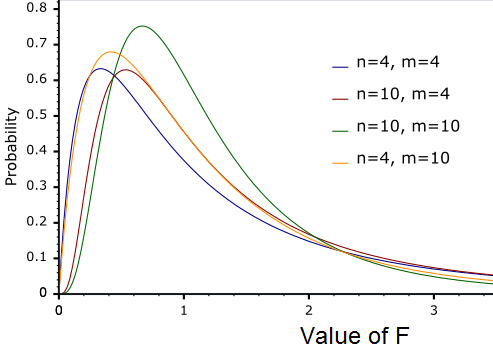

<style>
body {
text-align: justify}
</style>


```{r setup, include=FALSE}
knitr::opts_chunk$set(echo = TRUE)
```

## 1. Budapesti lakások vizsgálata

A <a href="https://raw.githubusercontent.com/KoLa992/Statisztika-II-Python-Jegyzet/main/BP_Lakas.csv" target="_blank">BP_Lakas.csv</a> fájl egy olyan adattábla, ami 1406 budapesti lakásról 10 változó (oszlop) adatát tárolja:

- KinArMFt: lakás ára millió Ft-ban (MFt)
- Terulet: lakás területe négyzetméterben
- Terasz: teraszok száma a lakásban
- Szoba: szobák száma a lakásban
- Felszoba: félszobák száma a lakásban
- Furdoszoba: fürdőszobák száma a lakásban
- Emelet: emeletek száma a lakásban
- DeliTaj: lakás déli fekvésű-e? (1 = igen; 0 = nem)
- Buda: lakás déli fekvésű-e? (1 = igen; 0 = nem)
- Kerulet: lakás kerülete (1 - 22)

Olvassuk be az adattáblát egy pandas `data frame`-be egy `readr_csv` függvény segítségével! A fájl olyan értelemben "jól vislekedő" *csv*, hogy az oszlopokat vesszők választják el egymástól, és a tizedes helyet tizedes pont jelöli, így nem kell a függvényben semmit sem külön paraméterezni. A beolvasás után egy `info` metódussal nézzük meg, hogy rendben van-e minden a betöltött `data frame`-el.

```{python}
# Elemzéshez és ábrázoláshoz szükséges csomagok betöltése
import numpy as np
import pandas as pd
import matplotlib.pyplot as plt
import scipy.stats as stats

# Budapesti lakások adatainak beolvasása
BP_Lakas = pd.read_csv("BP_Lakas.csv")
BP_Lakas.info()
```

Első ránézésre rendben vagyunk: 10 oszlopunk = változónk van a megfelelő oszlopnevekkel, mindenhol 1406 `non-null` megfigyeléssel.

Vizsgáljuk meg a lakások kínálati árának és a területének a kapcsolatát! Mivel logikusan azt gondolhatjuk, hogy a terület fogja meghatározni az árak alakulását, és nem fordítva, így a terület lesz a magyarázóváltozónk (*x tengely*) és az ár az eredményváltozónk (*y tengely*). A pontdiagrmos ábrázoláshoz a `scatter` című `matplotlib` függvényt tudjuk bevetni. A függvényben az első paraméter legyen az az oszlop, ami a diagram x tengelyét adja, míg a második az, amelyik az y tengelyét szolgáltatja az ábrának.

```{python}
plt.scatter(BP_Lakas.Terulet, BP_Lakas.KinArMFt)
plt.show()
```

Láthatjuk, hogy a terület növekedésével nőnek az árak, és ez a kapcsolat szoros is lehet, mert a pontokra gondolatban is elég jó pontossággal rá tudunk illeszteni egy pozitív meredekségű egyenest.<br>
Mindezt Stat. I-es ismereteink alapján egy korreláció kiszámításával tudjuk megerősíteni. Itt Pythonban korrlációt a `scipy` csomag `stats` moduljában lakó `pearsonr` függvénnyel tudunk számolni, aminek a bemenete a két numerikus változó, amik között korrelációt akarunk számolni. Itt a sorrend mindegy, nem számít hogy a magyarázóváltozót vagy az eredményváltozót adom meg a függvénynek első paraméterként.

```{python}
stats.pearsonr(BP_Lakas.Terulet, BP_Lakas.KinArMFt)
```
Az eredmény `statistics` része maga a korrelációs együttható, aminek jele $r$. Tehát, $r=+0.8597$. Ismétlésként meg kell emlékezni arról, hogyan is kell egy korrelációt értelmezni. Először is, egy korreláció mindig $\pm1$ közötti érték, azaz $-1\leq r \leq+1$. Egyébként, korreláció kapcsán mindig két kétdolgot kell vizsgálni:

1. Korreláció **előjele**: Ha ez *pozitív*, akkor a két változó közti kapcsolat *egyirányú* (ha nő az egyik érték,akkor várhatóan nő a másik is). Míg ha az előjel *negatív*, akkor a két változó közti kapcsolat *ellentétes irányú* (ha nő az egyik érték,akkor várhatóan csökken a másik is).
  * Esetünkben pozitív korrelációról beszélünk, azaz ha nő a lakás területe, akkor várhatóan nő az ára is. Ez teljesen logikus.
2. Korreláció **abszolút értéke**: Ha az abszolút érték, $0.3$ alatti ($|r|<0.3$), akkor a megfigyelt kapcsolat *gyenge* erősségű. Ha $0.3-0.7$ közötti ($0.3\leq|r|\leq0.7$), akkor *közepes*, míg $0.7$ feletti abszolút érték ($|r|>0.7$) esetén *erős* kapcsolatról bezsélünk a két változó között.
  * Esetünkben a korreláció abszolút értéke nagyobb, mint $0.7$ ($0.86>0.7$), így a lakások területe és ára közötti kapcsolat erősnek minősíthető.

Erre a korreláció értelmezésre utalt az a jelenség a fenti pontdiagramon, hogy a pontokra gondolatban is elég jó pontossággal (korreláció abszolút értékben magas) rá tudunk illeszteni egy pozitív meredekségű (pozitív előjelű korreláció) egyenest.

Ezen a korreláción túl kapunk a függvényből egy p-értéket is. Ez egy olyan **nullhipotézishez tartozik, amely azt mondja, hogy ez a korreláció a sokaságban** (a nem megfigyelt lakások körében) **lehet akár nulla is**. Tehát, a $H_0$ itt azt mondja, hogy a mintában megfigyelt korreláció a sokaságban tök $0$, a megfigyelt kapcsolat a sokaságban (a nem megfigyelt lakások körében) nem létezik. Szóval, itt a következő null- és alternatív hipotézis párosról van szó:

- $H_0:r=0$
- $H_1:r\neq0$

Ez az ominózus p-érték a fenti $H_0$ és $H_1$ pároshoz gyakorlatilag a függvény eredménye szerint $0.0$, szóval ez a $H_0$ minden szokásos szignifikancia-szinten elvethető, a korreláció a sokaságban (a nem megfigyelt lakások körében) nem vehető nullának, a a megfigyelt kapcsolat a sokaságban igenis szignifikánsan létezik.

A korreláció ($r$) négyzete megadja a determinációs együttható, tehát az $R^2=r^2$ értékét. Mivel a korreláció egy $[-1,+1]$ közötti szám, így négyzete egy $[0,1]$ közötti érték lesz, és így *százalékosan* értelmezhető: megadja, hogy az $x$ hány százalékban magyarázza $y$ alakulását/ingadozását:

```{python}
korrelacio = stats.pearsonr(BP_Lakas.Terulet, BP_Lakas.KinArMFt)[0] # a két számból az első, a 0. indexű volt ugye maga a korreláció
R_negyzet = korrelacio**2
R_negyzet
```

Esetünkben tehát azt mondhatjuk, hogy a **Terulet** $73.914\%$-ban határozza meg a **KinAr** alakulását. Vagy másképpen: a **Terulet** ismeretében $73.914\%$-os pontossággal lehet megcsülni a **KinAr** értékét. Ez így egy egészen jó előrejelző modell lenne, mivel a 10% alatti $R^2$-ű előrejelző modell magyarázóereje **gyenge**, 10%-50% között a magyarázóerőt **közepesnek** vesszük, és 50% felett (tehát ha a modell az eredményváltozóban lévő információ legalább felét megmagyarázta) mondjuk **erősnek**.

Ennyiből felmerülhet bennünk, hogy csináljunk egy olyan statisztikai modellt, ami a lakásárakat akarja előrejelezni a terület segítségével (hiszen abszolút értékben ezzel erősen korrelál a lakások kínálati ára)! Ez a modell lesz a **kétváltozós lineáris regresszió**! Ez a regresszió vagy más néven *regressziós egyenes*, az $y=KinAr$ és $x=Terulet$ pontdiagramon a pontokra legjobban illeszkedő egyenes.

Lássuk hát, hogyan is használható előrejelzésre ez a regressziós egyenes, és azt is nézzük meg, hogy miképpen tudja a `ggplot` berajzolni ezt az egyenest, mint a *pontdiagramra legjobban illeszkedő egyenes*t!

## 2. A Kétváltozós Lineáris Regresszió OLS elvű becslése

Az előző fejezetben már bevezettük az alábbi általános jelöléseket, de most álljon itt még egyszer a dolog, emlékeztetőként:

- $y$ := KinArMFt (**eredményváltozó**, amit előre akarunk jelezni)
- $x$ := Terulet (**magyarázóváltozó**, aminek ismeretében el akarjuk végezni az előrejelzést)

Középiskolában az $x$, $y$ koordináta rendszerben egy egyenes egyenletét az alábbi általános jelölésekkel írta le az ember.

$$y=mx+b$$

Itt ugye $m$ volt az egyenes *meredeksége*, míg $b$ a konstans tag, vagy másnéven *tengelymetszet*. A $b$, azaz a tengelymetszet megadja, hogy az egyenes hol metszi el az $y$ tengelyt, míg az $m$ megadja, hogy ha +1 egységet előre lépünk az $x$ tengelyen, akkor az $y$ tengelyen mennyit kell előre haladni, hogy az egyenesen maradjunk. Tehát, a *meredekség* megmutatja, hogy milyen gyorsan emelkedik/csökken az egyenes.

Lineáris regresszióban a fenti egyenes egyenlet az alábbi általános alakot ölti:

$$\hat{y}=\beta_1x+\beta_0$$

Ebben a felírásban az $\hat{y}$ jelenti az egyenletből **becsült árakat**. Ez a legfontosabb módosítás az egyenletben, hiszen $\hat{y} \neq y$!! Az $y$ a valós ára a lakásnak, míg az $\hat{y}$ a regressziós egyenes alapján, a $Terulet$ ismeretében becsült ár. Csak akkor lehetne $\hat{y} = y$ minden pontra (azaz minden lakásra), ha $R^2=100\%$ lenne, amit a pontdiagramon is láttunk, hogy nem áll fenn, mert **nem illeszkedik minden pont az egyenesre**! Ezen kívül tisztán látszik, hogy a második egyenletben a meredekséget és a tengelymetszetet csak "*átbetűztük*": $\beta_1=m$ és $\beta_0=b$.

Az egyenletben $x$ ismert minden lakásra, így nekünk csak a $\beta$-kat igazából valahogy meghatározni, hogy az egyenlet ténylegesen használható legyen a lakásárak megbecslésére. Ezt csinálja a `ggplot` is, amikor berajzolja a trendvonalat a pontdiagramon.

A $\beta$-k meghatározása teljesen logikus módon úgy történik, hogy az árakra ($y$) adott **becsléseink hibája minimális legyen**. A becslési hibát az ún. $SSE$ mutatóval mérjük: $Sum of Squared Errors (SSE) = \sum_{i=1}^n(y_i-\hat{y_i})^2$.<br>
Az $SSE$-ben, mint *hibafüggvényben* az egyedenkénti $y_i-\hat{y_i}$ hibatagot két okból emeljük négyzetre:

-  Büntetni kell az alá- és fölébecsléseket is...
- ...DE az abszolút érték függvény nem differenciálható, ami egy szükséges tulajdonság ha egy függvényt minimalizálni szeretnénk

Nézzük is meg, hogyan működik az $SSE$ a gyakorlatban! Első körben adunk valami **kezdeti tippeket a $\beta$-kra**, majd kiszámoljuk a $\hat{y}$-okat mind az 1406 lakásra, tehát meglesz minden $\hat{y_i}$, $i=1$-től $i=n$-ig:

```{python}
# Kezdetben minden Bétára azt tippeljük, hogy az értéke = 1
Beta0 = 1
Beta1 = 1

# Kiszámoljuk az y kalapokat, azaz a becsült árakat ezekkel a Bétákkal
BP_Lakas['BecsultAr'] = Beta1*BP_Lakas.Terulet + Beta0

# Kiszámolhatjuk a becslések hibáját is minden lakásra
BP_Lakas['Hiba'] = BP_Lakas.KinArMFt - BP_Lakas.BecsultAr

# Nézzük meg mit alkottunk
BP_Lakas.loc[:,["KinArMFt", "BecsultAr", "Hiba"]]
```

Láthatjuk, hogy a kezdeti tippeink a Bétákra még nem valami jók, 23-24 millió Ft-ot hibázik kb. a becslésünk lakásonként.

Nézzük meg, hogy a jelenlegi, csupa 1 $\beta$-k mellett milyen alakot ölt a **BecsultAr** oszlopban lévő $\hat{y_i}$-k által meghatározott regressziós egyenes! Itt egy olyan trükköt vetek be, hogy a korábban használt `matplotlib` csomag pontdiagramos `scatter` függvényére egy sima `plot` függvénnyel rárakom a regressziós egyenes $x$ és $\hat{y}$ koordinátáit, mint egy vonaldiagram. És ezzel akkor szépen ki is rajzolódik a jelenlegi $\beta_0,\beta_1$ értékekkel adódó regressziós egyenes:

```{python}
plt.scatter(BP_Lakas.Terulet, BP_Lakas.KinArMFt)
plt.plot(np.array(BP_Lakas.Terulet),
         np.array(BP_Lakas.BecsultAr), 'red')
plt.show()
```

Láthatjuk, hogy ez a regressziós egyenes még jó béna: a valós pontokhoz képest sokkal magasabban fut, nem jól illeszkedik rájuk.

Számoljuk is ki, hogy összességében mennyi a négyzetes hibánk, tehát az $SSE$! Itt azt használjuk, hogy a `data frame` oszlopokkal, mint `vector`okkal tudunk az R-ben számolni:

```{python}
# Egyik út
np.sum(BP_Lakas.Hiba**2)

# Másik út
np.sum((BP_Lakas.KinArMFt - BP_Lakas.BecsultAr)**2)
```

Giganagy az SSE, de ezen már az előbbiek alapján meg sem lepődünk. :)

Az előbbi pontdiagram alapján azt láthatjuk, hogy a regressziós egyenesnek az a baja, hogy túl magasról indul (túl magas a tengelymetszet) és túl gyorsan is emelkedik (túl magas a meredekség). Szóval mindkét $\beta$-t csökkentsük. Szemmértékre nem tűnik rossznak ha az egyenest $\beta_0=-0.5$-ról indítjuk, és az emelkedés ütemét megfelezzük: $\beta_1=0.5$. Nézzük is meg mit tudunk ezzel alkotni:

```{python}
# Újra értékadás a Bétáknak
Beta0 = -0.5
Beta1 = 0.5

# Kiszámoljuk az y kalapokat, azaz a becsült árakat ezekkel a Bétákkal
BP_Lakas.BecsultAr = Beta1*BP_Lakas.Terulet + Beta0

# Kiszámolhatjuk a becslések hibáját is minden lakásra
BP_Lakas.Hiba = BP_Lakas.KinArMFt - BP_Lakas.BecsultAr

# Ábrázoljuk az új egyenest a pontdiagramon
plt.scatter(BP_Lakas.Terulet, BP_Lakas.KinArMFt)
plt.plot(np.array(BP_Lakas.Terulet),
         np.array(BP_Lakas.BecsultAr), 'red')
plt.show()
```

Ez már sokkal jobban néz ki! De vajon csökkent az $SSE$ is?

```{python}
np.sum(BP_Lakas.Hiba**2)
```

Jepp, $352005<4767764$, szóval ez objektívan, és nem csak diagramról nézve is egy jobb illeszkedés! :)

Mielőtt továbblépünk bevezetek egy jelölést, $\epsilon$-al fogjuk jelölni a regressziós modell hibatagját. Ezzel, a kódban lévő első képlet formálisan így néz ki: $SSE=\sum_{i=1}^n(\epsilon_i)^2$.

Akkor hát, hagyjunk fel a "kézimunkával", és kerestessük meg a gépállattal azokat a $\beta$-kat, amikkel a lehető legkisebb $SSE$-t kapjuk!

Ehhez először megcsinálunk egy külön R függvényt az $SSE$-re, ami $SSE(\beta_0,\beta_1)$ alakot ölt. Tehát, megadja az $SSE$-t a $\beta$-k függvényében:

```{python}
# a függvény megadása
def SSE(x):
  return np.sum((BP_Lakas.KinArMFt-(x[0]+x[1]*BP_Lakas.Terulet))**2)

# a függvény használata úgy, hogy mindkét Béta értéknek 1-et mondunk
SSE(np.array([1,1]))
```

Láss csodát a csupa 1 $\beta$-kra ugyan azt az $SSE$-t kapjuk, mint korábban! :)

Na, ezt az $SSE$ függvényt felhasználva meg tudjuk kerestetni gépállattal hol vannak azok a $\beta$-k, amik mellett a legkisebb összesített négyzetes modellhibát kapjuk. A használt `minimize` függvény a `scipy` csomag lakója:

```{python}
from scipy.optimize import minimize # függvény importja scipy-ból
eredmeny = minimize(SSE,np.array([1,1])) # az hiba minimalizálást a minden Béta = 1 pontból indítjuk
```

Az újonnan létrehozott, `eredmeny` objektumból, ami `dictionary` típusú, ki tudjuk olvasni, hogy mik lettek a $\beta$-k, és meg tudjuk nézni azt is, hogy mi az a legkisebb $SSE$ érték, amit el tudtunk érni:

```{python}
eredmeny.x # a Béták

eredmeny.fun # a minimalizált SSE érték
```

Ezzel a végső regressziós egyenletünk: $BecsultAr=-4.312 + 0.400\times Terulet$. Ez így az úgynevezett **OLS (Ordinary Least Squares)** feladat megoldása.

Meg is nézhetjük, hogy az ezekkel a $\beta$-kal rajzolt egyenes miképpen néz ki a pontdiagramon:

```{python}
# Újra értékadás a Bétáknak
Beta0 = eredmeny.x[0]
Beta1 = eredmeny.x[1]

# Kiszámoljuk az y kalapokat, azaz a becsült árakat ezekkel a Bétákkal
BP_Lakas.BecsultAr = Beta1*BP_Lakas.Terulet + Beta0

# Kiszámolhatjuk a becslések hibáját is minden lakásra
BP_Lakas.Hiba = BP_Lakas.KinArMFt - BP_Lakas.BecsultAr

# Ábrázoljuk az új egyenest a pontdiagramon
plt.scatter(BP_Lakas.Terulet, BP_Lakas.KinArMFt)
plt.plot(np.array(BP_Lakas.Terulet),
         np.array(BP_Lakas.BecsultAr), 'red')
plt.show()
```

Ami nagyon fontos, hogy amiatt, hogy a hibát négyzetesen értelmeztük OLS-ben, ezek a $\beta$-k,a mit megkaptunk **egyértelműek**!! Akárhányszor futtatom az optimalizálást mindig ugyan ezeket az értékeket fogom kapni! Ha a hibatagok összeadásakor abszolút értéket alkalmaztam volna, akkor ez a luxus nem lenne meg! Ott minden optimalizálásnál fennállna az esélye, hogy más $\beta$-kat kapok, mint az előző esetben, és a $\beta$-król nem is tudnám eldönteni, hogy ezekkel az értékekkel kapom-e ténylegesen a legkisebb becslési modellhibát!

A négyzetesen mért hiba esetében ez az egyértelműségi probléma azért nincs meg, mert valójában a gép itt **nem vaktában keresi** a $\beta$-kat! Az OLS feladat megoldása (tehát a legkisebb $SSE$-t adó $\beta$-k) kifejezhetők egy fix képlettel.

Valójában a kétváltozós $SSE(\beta_0,\beta_1)=\sum_{i=1}^n(y_i-\hat{y_i})^2=\sum_{i}(y_i-\beta_0-\beta_1x_i)^2$ függvény minimumhelyének meghatározása történik ezen a ponton. Mivel a `data frame`-ben minden eredményváltozó ($y_i$) és magyarázóváltozó ($x_i$) érték ismert, így ezek a függvényben *konstansnak* vehetők, a függvény két változója csak a $\beta_0$ és a $\beta_1$. Emiatt a függvény minimumhelyét úgy kereshetjük meg, hogy vesszük ennek az $SSE(\beta_0,\beta_1)$ hibafüggvénynek a parciális deriváltjait a két $\beta$ szerint, és azokat egyenlővé tesszük nullával.

Magyarul megoldjuk az alábbi két egyenletből álló egyenletrendszert:

$$\frac{\partial SSE(\beta_0,\beta_1)}{\partial \beta_0}=0$$

$$\frac{\partial SSE(\beta_0,\beta_1)}{\partial \beta_1}=0$$

Az egyenletrendszer megoldásával kifejezhető az a fix formula, amivel az OLS elven számított $\beta_0$ és $\beta_1$ értékek megadhatók:

$$\hat{\beta_1}=\frac{\sum_{i=1}^n{(x_i-\bar{x})(y_i-\bar{y})}}{\sum_{i=1}^n{(x_i-\bar{x})^2}}$$

$$\hat{\beta_0}=\bar{y}-\hat{\beta_1}x$$

Azt, hogy konkrétan hogyan jön ki ez a csodaszép két formula szorgalmi feladatként levezethető +1 pontért. :) <br>
A gyakorlati szempontból azt kell látni, hogy minimalizálási feladathoz nem is kell az `optim` függvény, mert a megoldása van egy-egy fix képlet. **Emiatt használják az OLS regressziót mai napig előszeretettel: fix képlettel megadhatók a $\beta$ együtthatók, és nem kell a megadásukhoz optimalizálni!**

## 3. Az OLS Regresszió magyarázóerejének mérése

Megmérhetjük azt is, hogy a lakások területe hány %-ban magyarázza az áraik ingadozását az átlagos ár körül. Sőt, igazából ezt meg is mértük már a korreláció négyzetével, a determinációs együtthatóval ($R^2$) és $73.899\%$-nak adódott. De ez az érték meghatározható az $SSE$ hibafüggvényünk alapján is!

Ehhez ki kell számolni, hogy mennyi az eredményváltozóban lévő teljes ingadozás, azaz **információtartalom**, ami megmagyarázható. Ezt úgy mérjük meg, hogy megnézzük mi lenne az $SSE$, ha az eredményváltozót (az árakat) 0 magyarázóváltozóval akarjuk megbecsülni, előrejelezni. Mondván ennél rosszabb becslést nem adhatunk az eredményváltozóra, így ennek a becslésnek az összhibáját tudjuk csökkenteni a magyarázóváltozókat használó regressziós modellel. Ha **nincs magyarázóváltozónk, akkor a becslésünk minden esetben az átlagár** lesz: $\hat{y}=\bar{y}$.

Ezzel azt mondhatjuk, hogy a magyarázóváltozók nélküli **nullmodell** $SSE$-je valójában az $SumOfSquaredTotals=SST=\sum_{i=1}^n(y_i-\bar{y})^2$, tehát az egyes lakások árainak négyzetes ingadozása az *átlagos ár* körül. Ezt hívjuk az **eredményváltozóban lévő teljes megmagyarázható információ**nak!

Számoljuk is ezt ki a lásárakra!

```{python}
SST = np.sum((BP_Lakas.KinArMFt - np.mean(BP_Lakas.KinArMFt))**2)

SST
```

Ha a modell hibaszázalékát akarjuk megnézni, akkor egyszerűen az $SSE$-t elosztom az $SST$-vel. Hiszen ekkor megkapom, hogy a modell az összes megmagyarázható információból $SST$ mennyit **nem** tudott megmagyarázni ($SSE$).<br>
Nyilván, ha ennek a hányadosnak veszem a komplementerét (1-), akkor megkapom a modell által megmagyarázott információ-hányadot. Ez lesz a már ismerős **R-négyzet**, vagy szebb szóval **determinációs-együttható**: $R^2=1-\frac{SSE}{SST}$.

Számoljuk is ki:

```{python}
SSE = eredmeny.fun
1 - SSE / SST
```

Tehát, **a lakások területe továbbra is 73.914%-ban magyarázza a lakások árának ingadozását** (alakulását). Ez egy elég jó modell még mindig! :)

Mindez képletek szintjén összefoglalva (szokjunk hozzá, hogy az angol könyvekben az SSE-t néha ESS-nek is jelölik :)):

<center>
{width=50%}
</center>

<center>
{width=50%}
</center>

## 4. A Regresszió magyarázóereje nem megfigyelt adatok körében

Szép és jó, hogy tudom, hogy a regresszióm magyarázóereje durván 74%, de ez csak azt mondja, hogy a **megfigyelt 1405 lakás esetében magyarázza kb. 74%-ban a terület az árak alakulását**! Szeretnék valamit mondani azért a modell magyarázóerejéről a nem megfigyelt lakások körében is! Hiszen az $\hat{y}$ becsléseket arra akarom használni, hogy új, eddig még nem látott budapesti lakások esetében is meg tudjam becsülni az árakat a terület alapján! Tehát, a regresszió viszelkedésére vagyok kíváncsi a budapesti lakások **sokaság**ában!

Ennek az eszköze a klasszikus Statisztikában a **hipotézisvizsgálat**!

A hipotézisvizsgálatunk kérdése tehát az, hogy mi történik a megfigyeléseinken (mintánkon) túli világban (leánykori nevén sokaságban) ezzel a regressziós modellel? Ha új lakásokra általánosítjuk ki az OLS regressziós modellt, akkor az $R^2$ értéke megmarad vagy összeomlik 0-ra?

Ezt a kérdést lehet megválaszolni egy $R^2$-re adotthipotézisvizsgálattal, a **Globális F-próbával**.

Konkrétan ebben az esetben a hipotézisvizsgálat 4 lépéses folyamat így néz ki:

1. Pesszimista emberek vagyunk, azt gondoljuk, hogy modellünk a mintán kívüli világban semmit nem magyaráz, azaz $R^2=0$
    - Hopp, ez egy egyenlőséggel adott állítás! Mehet $H_0$-ba --> $H_0: R^2 = 0$ (vagyis a modell nem szignifikáns a sokaságban)
    - Alternatív esetben pedig legyünk optimisták: ebből a magyarázóerőből, amit a mintában mértünk, fog maradni akkor is valami, ha új lakásokat kezdünk vizsgálgatni a sokaságból --> $H_1: R^2 > 0$ (vagyis a modell szignifikáns a sokaságban)
2. A próbafüggvényt számoljuk a mintában mért R-négyzet, a mintaelemszám ($n$) és az egyenletben használt $\beta$ paraméterek száma ($p$) alapján!
    - Nekünk: $R^2=0.73914, n=1406, p=2$
    - Próbafüggvény képlete: $\frac{R^2/(p-1)}{(1-R^2)/(n-p)}=\frac{0.73914/(2-1)}{(1-0.73914)/(1406-2)}=3978.197$
3. Ez a **próbafüggvény igaz $H_0$ esetén** egy úgynevezett **F-eloszlást követ**.
    - Azt, hogy ez az eloszlás sűrűségfüggvényként hogy néz ki, két szabadságfok (szf vagy df) szabályozza:
    <center>
{width=50%}
</center>
    - Ezt a két szabadságfokot mi az elemszámból és a magyarázóváltozók számából fogjuk megkapni a saját próbafüggvényünkre.
        * $df_1=p-1=2-1=1$ és $df_2=n-p=1406-2=1404$
    - $H_0$ akkor biztosan (100%-os valószínűséggel) igaz, ha $R^2$ már a mintában is 0.
    - Ezért a p-értékkel azt mérjük le, hogy "milyen messze vagyunk" ettől a $H_0$ szempontjából ideális állapotról az igaz $H_0$ esetén fennálló eloszlásban.
    - Egész konkrétan így:
        <center>
{width=50%}
</center>
    - Tehát, a p-érték most a próbafüggvény feletti terület a megfelelő F-eloszlásban. Hiszen, így a *próbafüggvény = 0* esetben 100%-ra jön ki a p-érték, ami azt jelenti, hogy $H_0$-t elvetni tuti, hogy hibás döntés. A próbafüggvény pedig arányosan nőni fog, ha $R^2$ is nő, így ha kellően magas az érték, akkor már nagyon kicsi lesz a felette lévő terület, így alacsony annak a valószínűsége, hogy $H_0$ elvetésével hibát követünk el.
    - F-eloszlásban egy értékhez tartozó "felé esési" valószínűséget Pythonban a következő `scipy`-os `cdf` függvénnyel kapjuk meg (fiygeljünk arra, hogy a szabadságfokok sorrendje a 2.és 3. paraméterben számít): `1-stats.f.cdf(3978.197,1,1404) = 1.1102e-16` = 0.
4. Ez a p-érték jó alacsony, konkrétan 0%-nak vehető. Tehát még ha azt is, mondom, hogy csak $\alpha=1\%$ valószínűséggel engedek meg igaz $H_0$-t elutasítani, ez a valószínűség még ennél is kisebb.
    - Tehát nyugodtan elvethetem $H_0$-t, mivel ezzel a döntéssel 0% az esélye, hogy hibázok.
    
**!!!VIGYÁZAT!!!** --> *Kellően nagy minták esetén ebből a tesztből simán kijöhet egy 3,4%-os mintabeli $R^2$ esetén is, hogy $H_1$ állítást kell igaznak venni. Ami annyit jelent, hogy azt a 3.4%-os $R^2$-et ki lehet általánosítani a megfigyeléseken túli világra is…de ez azért nem olyan jó eredmény, mintha egy 74%-os $R^2$-re jön ki ugyan ez egy ilyen hipotézisvizsgálatból!*

*Megjegyzés*: Globális F-próbában $H_0$-t úgy is meg lehet fogalmazni, hogy a modellben a meredekség 0 a mintán kívüli világban: $\beta_1=0$. A $H_1$-et meg ilyenkor úgy lehetne felírni, hogy a meredekség nem nulla: $\beta_1\neq0$.

## 5. A modell együtthatóinak értelemzése

A kétváltozós OLS modellünk két $\beta$ paramétere tehát az alábbiak és a következő jelentéstartalommal bírnak:

- $\beta_0=-4.312$ --> Ő ugye a tengelymetszet, ami megadja, hogy a regressziós egyenes hol metszi az $y$ tengelyt, ami az $x=0$ helyen történik. tehát, technikailag megadja, hogy $x=0$ esetén mi a regresszió $\hat{y}$ becslése. 
- $\beta_1=+0.400$ --> Ez itt pedig a meredekség, ami megmutatja, hogy +1 egység elmozdulás esetén az $x$ tengelyen hogyan változik az $\hat{y}$.

A mi példánkban ez azt jelenti, hogy egy 0 $m^2$-ú lakás **becsült** ára -4.312 M Ft. Nyilván ezzel az értelmezéssel most nem kell foglalkozni, mivel az $x=0$ hely jelen adatbázisunkban nem létezik. :)<br>
A meredekség alapján pedig azt mondhatjuk, hogy +1 négyzetméter terület a lakás értékét **várhatóan** (hiszen $\hat{y}$-ról beszélünk) 0.400 M Ft-tal, azaz 400 E Ft-tal növeli. Ha nagyon közgázosak akarunk lenni, akkor ez a 400 ezer Ft a +1 négyzetméter **hasznossága**!

Kimondottan a $\beta_1$ értelmezésénél nagyon-nagyon figyeljünk oda, hogy **az értelmezés nagyon mértékegységfüggő**!! Tehát, a +1 egység $x$ az mindig az $x$ mértékegységében értendő, ami most nekünk négyzetméter. Míg maga a $\beta_1$-nyi változás pedig értelemszerűen az $y$ mértékegységében adott, ami a példánkban MFt!

## 6. Egy gyakorló példa COVID adatokon

Töltsük be a <a href="https://github.com/KoLa992/Statisztika-II-Python-Jegyzet/raw/main/COVID_0326.xlsx" target="_blank">COVID_0326.xlsx</a> c. Excel fájlt egy **covid** nevű pandas `data frame`-be!

```{python}
covid = pd.read_excel("COVID_0326.xlsx")
covid.info()
```

A fájlból betöltött tábla a Föld 100 országára, mint megfigyelési egységekre nézve tartalmazza az alábbi 9 változó adatait:

- Country: ország neve
- Pop: ország népessége (fő)
- PopDens: népsűrűség (fő/km2)
- Prop_UrbanPop: Városi népesség aránya 2019-ben (%)
- PressLiberty: Sajtószabadsági index 2019-ben (alacsonyabb = szabadabb sajtó)
- PerCapita_HealthExp_2016: Egy főre jutó eüg-i kiadások, vásárlóerő-paritáson számolva (2016)
- COVID19_CasesPerMillion: Egymillió főre jutó COVID-19 fertőzöttek száma 2020.03.26-án
- ConstitutionalForm: államforma
- HeadOfState: államfő jogkörei (hatalmat gyakorol vagy csak reprezentatív szerepkörű)

Nézzünk egy kétváltozós regressziót az egymillió főre jutó COVID esetszám (**COVID19_CasesPerMillion**) és a sajtószabadsági index (**PressLiberty**) között. Egy logikus fektételezés, hogy az ország sajtószabadsági indexéből következik az, hogy a COVID járvány korai szakaszában (2020. március 26-án) hány COVID fertőzöttet regisztráltak az országban népességarányosan. Mondván egy sajtónyilvánosabb országban kevésbé tudja eltitkolni a központi egészségügy a fertőzöttek valódi számát. Ebből adódóan a magyarázóváltozó lesz a regresszióban az **x = PressLiberty** és az eredményváltozó pedig az **y = COVID19_CasesPerMillion**. És akkor a következő regressziós egyenlet $\beta_1,\beta_0$ együtthatóit kéne megbecsülni a data frame-ben található 100 ország adatai alapján $$Becsült COVID19=\beta_1 \times PressLiberty+ \beta_0$$

Szerencsére, nem kell újra a `minimize` függvénnyel szenbednünk ahhoz, hogy megkapjuk a $\beta_1,\beta_0$ regressziós együtthatók legkisebb négyzete elvű (OLS) becslését. A `numpy` csomag `polyfit` függvénye legyártja ezeket nekünk. A függvény első paramétere a magyarázóváltozó ($x$), második az eredményváltozó ($y$) a regresszióban. Míg a harmadik paraméterben, egy `deg=1` beállítással azt jelezzük a gépállatnak, hogy  a megadott $x$ és $y$ koordinátákra egyenest illesszen, ne valami bonyolultabb alakzatot (pl. másodfokú polinomot).

```{python}
Beta1, Beta0 = np.polyfit(covid.PressLiberty, covid.COVID19_CasesPerMillion, deg = 1)
print([Beta1, Beta0])
```

A 100 országra legjobban illeszkedő egyenes egyenlete tehát: $$Becsült COVID19=-4.28 \times PressLiberty+ 214.9$$

Tehát, ha a sajtószabadsági index 1 egységgel nő (azaz a sajtó egy egységgel kevésbé lesz szabad) egy országban, akkor *várhatóan* 4.28 eset/millió fővel **csökken** az ország fertőzötteinek száma. Érdekes eredmény, de ez feltehetőleg azért van így, mert 2020.03.26-i állapotokat tükröz az adatbázis, és akkor még intenzív tesztelést inkább csak a gazdagabb, és szabadabb sajtóval bíró országok végeztek. Plusz, a sok kis észak-európai államban (Belgium, Hollandia, Dánia, stb.) nagy a sajtószabadság, de nagy a városi népesség aránya és a népesűrűség is, így ott nyilván jobban tud terjedni a vírus. De nyilván benne van ebben a negatív együtthatóban az is, hogy ekkor egy Pakisztán nagyon igyekezett még eltitkolni a fertőzöttek valós számát és a Pakisztánnál szabadabb sajtóval bíró Olaszországban nem igazán tudták eltitkolni, hogy mekkora a baj.<br>
Érdekességképpen elmondhatjuk, hogy egy 0 szajtószabadsági indexszel (tehát a legszabadabb sajtóval) rendelkező országan a modell 214.9 fertőzöttet becsül 1 millió főre.

Nézzük meg a modell %-os magyarázóerejét, azaz az $R^2$ mutatóját.

```{python}
(stats.pearsonr(covid.PressLiberty, covid.COVID19_CasesPerMillion)[0]**2)*100
```

Láthatjuk, hogy a modellnek csak egy közepes (de nem gyenge!) magyarázóereje van, hiszen a sajtószabadsági index csak $24.41\%$-ban magyarázza az egymillió főre jutó esetszámok alakulását, ami 10%-50% közötti érték.

Nézzük meg, hogy ez az $R^2$ lehet-e $0\%$ nem megfigyelt országok esetén (a Föld országainak telejs sokaságában)? Azaz, nézzük meg a glogális F-próba p-értékét!

Ehhez először kell egy próbafüggvény a 4. fejezetből megismert képlet alapján:

```{python}
probafuggveny_F = (0.2441/(2-1))/((1-0.2441)/(100-2))
```

Majd jobboldali módon jöhet a p-érték egy $F(2-1,100-2)$ eloszlásból.

```{python}
1-stats.f.cdf(probafuggveny_F,1,98)
```

Tehát, a modell F-próbájának p-értéke csupán $1.75 \times 10^{-7}$, ami kisebb még a legkisebb szokásosnak mondható $\alpha=1\%=0.01$ szignifikancia-szintnél is, így azt mondhatjuk, hogy a modell $24.41\%$-os magyarázóereje szignifikáns marad a 100 megfigyelt országon kívüli világban is.

Mindezen eredmények vizualizálva pontdiagramon:

```{python}
# Kiszámoljuk az y kalapokat, azaz a becsült árakat ezekkel a Bétákkal
covid['BecsultCOVID'] = Beta1*covid.PressLiberty + Beta0

# Ábrázoljuk az új egyenest a pontdiagramon
plt.scatter(covid.PressLiberty, covid.COVID19_CasesPerMillion)
plt.plot(np.array(covid.PressLiberty),
         np.array(covid.BecsultCOVID), 'red')
plt.show()
```

Láthatjuk, hogy a pontokra legjobban illeszkedő egyenes negatív meredekségű, csökkenő trendet mutat, és aránylag jobban szóródnak az egyenes körül a pontok, és a 95%-os konfdiencia-intervalluma is viszonylag (de nem vészesen) tág, de az egymillió főre jutó esetszámok csökkenő trendje a **PressLiberty** függvényében még szépen kirajzolódik. Mindez az $R^2$ által is jelzett közepes erőséggű kapcsolatra utal.